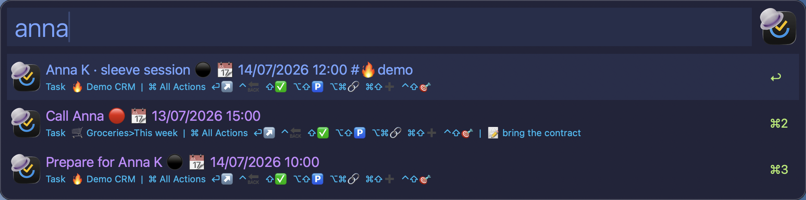
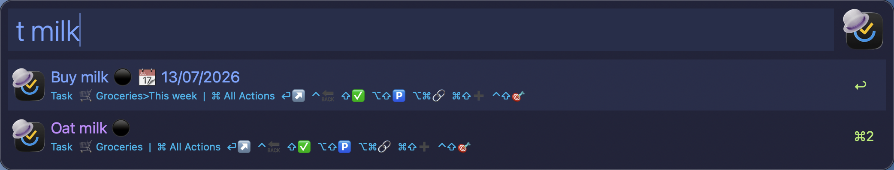
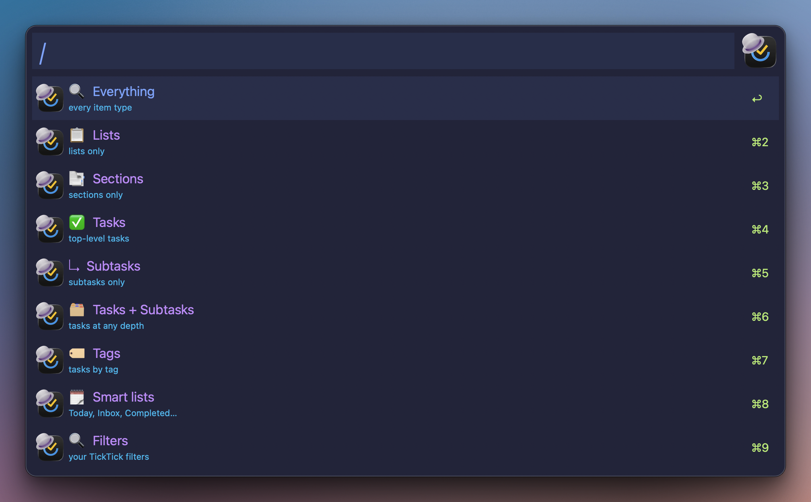
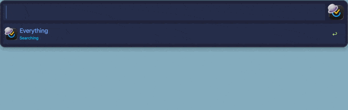
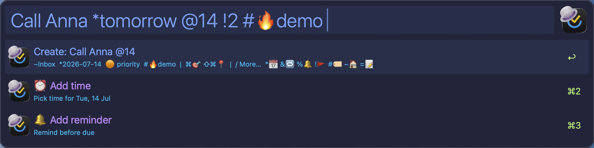
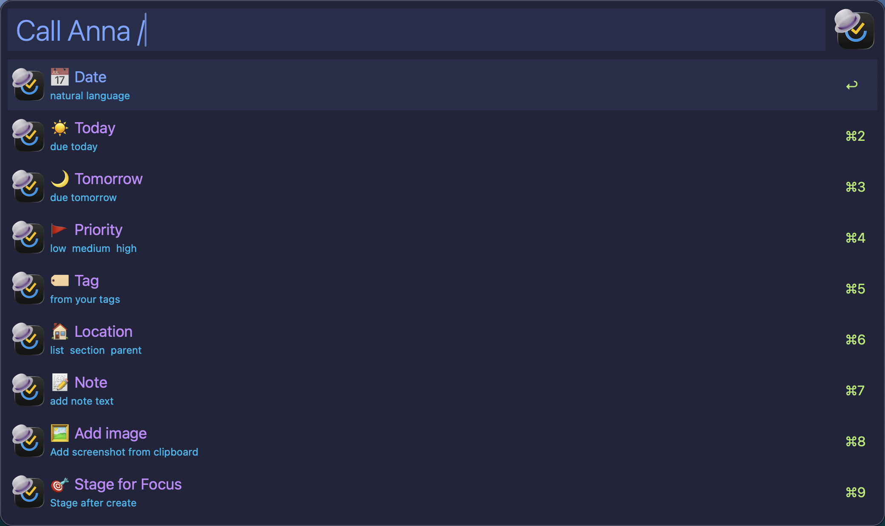
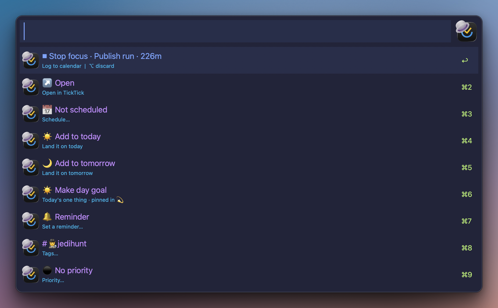
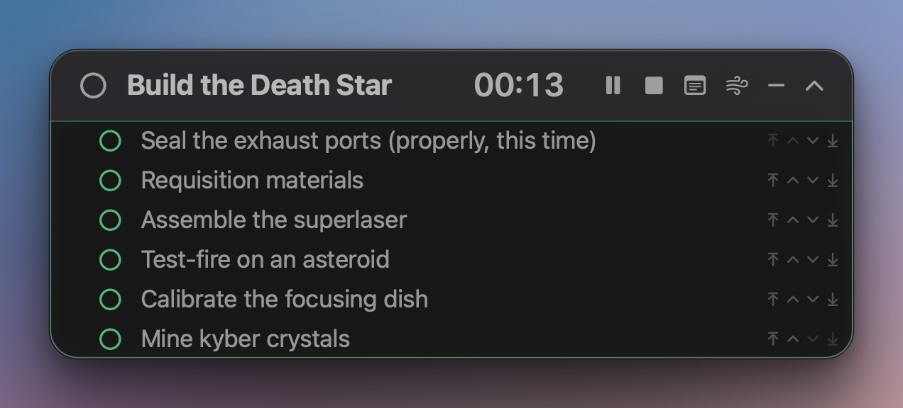
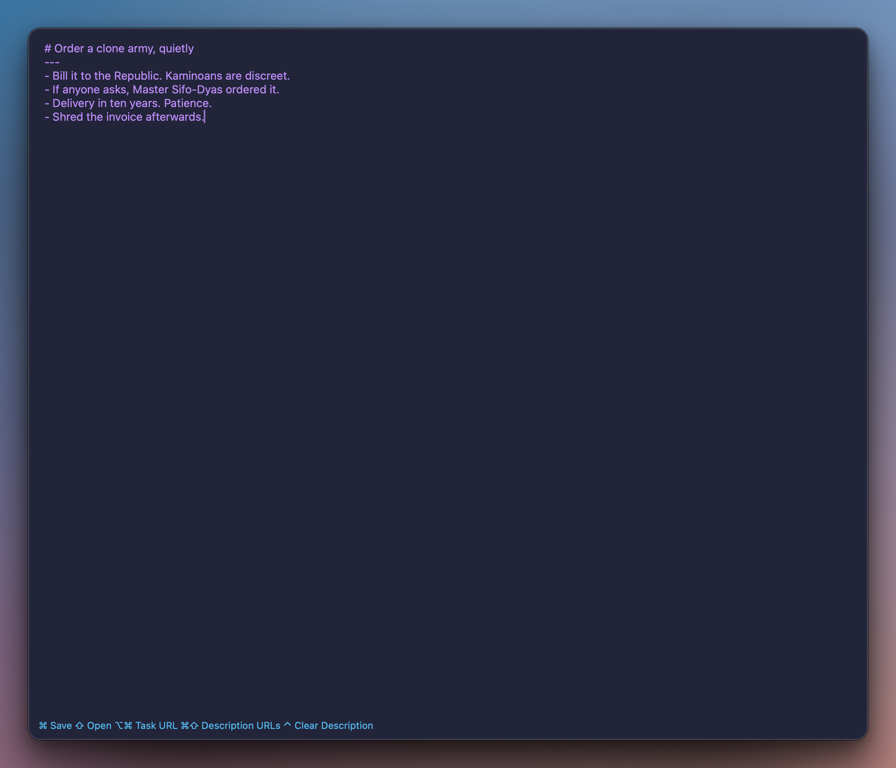
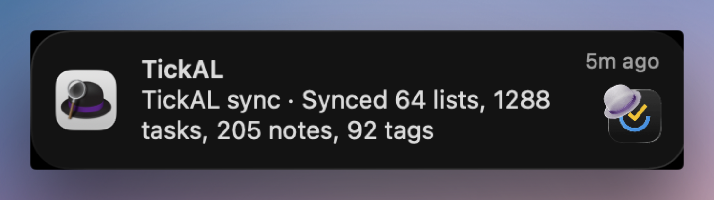

# TickAL

> **TickTick, without opening TickTick**

Fast, keyboard-driven command bar for TickTick, inside Alfred. 

[Search](docs/40-search.md), [add](docs/42-add.md), [browse](docs/41-browse-drill.md), [schedule](docs/43-actions.md#schedule), [tags](docs/43-actions.md#tags), complete, [focus](docs/44-focus.md), [edit notes and descriptions](docs/46-notes-links-images.md#edit-a-note-body), open the calendar, [mint periodic notes](docs/47-periodic.md), [save web pages](docs/46-notes-links-images.md#save-a-url), [open sticky notes](docs/46-notes-links-images.md#sticky-notes), [organise projects](docs/49-projects.md), [run a CRM](docs/45-crm.md), and more... 

Every change lands in a [local cache](docs/90-settings-sync.md#cache-model) first, so nothing waits on the network between keystrokes.

*All without touching the mouse.*

  

> [!IMPORTANT]
> **First run** - keyword `tlogin` after setting credentials in config

> Keyword `tal` OR hotkey (set in canvas)

Four main keys run everything, on every screen:
**`⌥⏎` deeper · `⌘⏎` actions · `⌃⏎` back · `/` more** 
Type to filter. 

> [!TIP]
> **Quick Links**
> - [Getting started](docs/10-getting-started.md) for impatient, jump straight in
> - [Setup](docs/30-setup.md) for complete and detailed setup steps 
> - [Cheatsheet](docs/95-cheatsheet.md) for every activation method of every action
> - [Official docs](https://github.com/vex-glitch/TickAL-TickTick-Alfred-Workflow/blob/main/docs/00-index.md) for a detailed breakdown of each function

## 🔎 Search

> **One search engine for lists, sections, tasks, subtasks, tags, folders, smart lists, filters, notes and note bodies, periodic notes, and last added.**

> Keyword `tse` OR hotkey (set in canvas) OR Main menu > Search

Thirteen prefixes narrow the scope (e.g. <code>t</code> searches tasks only), while <code>/</code> lists all the scopes 🖼️

Habits, matrix, pomodoro, today, tomorrow, next 7 day, inbox, summary, completed, won't do, periodic notes are all actionable from search.  
Just type: `today`, `tomorrow`, `inbox`, `completed`, `daily note` or `weekly note`...

Task rows show:
- Priority: `🔴 🟠 🟡 ⚫️`
- Date/time/duration: `📆 2026-07-14 14:15-15:30`
- Tags: `#💼Project`
- Type: `Task`
- Number of subtasks: `3 subtasks`
- Breadcrumbs: `List › section (if any) › parent task (for subtasks)`
- Description: `📝 First-line peek of task note`

> [!TIP]
> More on search scopes/mechanics: [Docs • Search](docs/40-search.md)

## ⌥ Browse

> **Drill into (browse in Alfred) any folder → list → tag OR section → task → subtask ladder with `⌥⏎` and walk back up with `⌃⏎`.**

> *`⌥⏎`* on any row

- Filters, smart views (Inbox, Today, Tomorrow...), tags included.
- `📋 Show-all` flattens a whole list, grouped by your own TickTick tag order with priorities first.
- Habits, Pomodoro and Matrix aren't drawn in Alfred - `tha` / `tpo` / `tmx` jump to TickTick's own screens ([Views](docs/48-views.md))

> [!TIP]
> More on browse & drill: [Docs • Browse](docs/41-browse-drill.md)

## ➕ Add

> **No dialogs, no tab-through - the whole task is one token line:**
> 
> `tad Electrocute Yoda *tomorrow @12:00 !3 #⚔️War ~l ⚡️ Sith Secrets =Yell "Unlimited Power" while at it.`
> 
> Description field shows assigned attributes live

> Keyword `tad` OR hotkey (set in canvas) OR Main menu > Add OR `⌘⇧⏎` on any row

Tokens cover the basics you'd expect - date, time, priority, tag, list, repeat, reminder.

<code>/</code> opens the token menu whenever you forget one 🖼️

Past what TickTick's own quick-add reaches, the same line can:
- block out a **duration**, not just a time (`>90m`)
- drop the task into a **section**, or make it a **subtask** (`~s`, `~p`)
- **link to another task** (`[[`)
- attach a **clipboard image** as a real file (`^`)
- create a **list, note, project, or tag** instead of a task (`L / N / P / T`)
- chain straight into a **running focus session** (`⌘⏎`)

> [!TIP]
> More on add mechanics: [Docs • Add](docs/42-add.md)

## ⌘ Actions

> **Invoke dynamic list of every action available per item type and conditions with `⌘⏎` on any row** 

> *`⌘⏎`* on any row

- [Schedule](docs/43-actions.md#schedule), [move](docs/43-actions.md#move), [rename](docs/43-actions.md#rename), [priority](docs/43-actions.md#priority), [tags](docs/43-actions.md#tags), [convert task ↔ note](docs/43-actions.md#convert-to-note--task), copy link, complete, delete and more. 
- Tag rows get [their own menu](docs/43-actions.md#tag-smart-list-and-buffer-menus) (open, [drill](docs/41-browse-drill.md#the-drill-ladder), send everything to [focus](docs/44-focus.md), delete). 

> [!TIP]
> More on the actions matrix: [Docs • Actions](docs/43-actions.md)

## 🎯 Focus

> **Start a [timer](docs/44-focus.md#start) ⏱️ or [pomodoro](docs/44-focus.md#start) 🍅 on any task. Open a [Focus bar](docs/44-focus.md#the-bar) and a sticky note. One keystroke leads to focus. No clicking around.**

> [!IMPORTANT]
> A workflow with many moving parts - sessions, staging, sweep, the bar - read [Docs • Focus](docs/44-focus.md) before using. The floating bar needs PyObjC - [one Settings row](docs/30-setup.md#focus-bar) installs it.

> Keyword `tfo` OR hotkey (set in canvas) OR Main menu > Focus OR `⌃⇧` on a task

- *Open the focused task as a [sticky note](docs/46-notes-links-images.md#sticky-notes) - from Alfred, no right mouse clicks.*
- Stage [checkbox blocks](docs/44-focus.md#checkbox-blocks) in the focus task (one at a time, a whole tag or section, today's list, or act on multiple tasks at once via 🅿️ [buffer](docs/41-browse-drill.md#buffer-))
- Tick boxes as you go
- [Sweep](docs/44-focus.md#sweep--the-focus-record): every ticked box completes its real task - and vice versa
- **[Floating focus bar](docs/44-focus.md#the-bar)** shows the clock and ticks, open sticky note, pause and stop focus, reorders and sweeps without opening Alfred

> [!TIP]
> More on Focus workflow: [Docs • Focus](docs/44-focus.md)

## 💫 Periodic notes

> **Obsidian-style [daily](docs/47-periodic.md#the-daily-note), [weekly](docs/47-periodic.md#the-weekly-note), monthly, quarterly and yearly notes minted inside TickTick**

> [!IMPORTANT]
> A workflow with many moving parts - read [Docs • Periodic notes](docs/47-periodic.md) before using. Stays dormant until you set the list id ([setup](docs/47-periodic.md#setup)).

> Keyword `tpn` OR direct keywords (`tdn`, `tmj`, ...) OR hotkey (set in canvas) OR Main menu > Periodic OR straight from search

- Auto-mints on open, or every morning at 04:30 via an optional [agent](docs/47-periodic.md#the-0430-agent) that seals the periods that just closed
- Breadcrumbs link the whole pyramid
- Mornings bring weather, a quote, countdowns and habits
- Logs your mood (😊) and rates the day (★)
- [Journals](docs/47-periodic.md#journals) ask their questions in prompt dialogs
- Links goals down the pyramid: a daily one-thing, a weekly goal, next week's goals from the [weekly review](docs/47-periodic.md#the-weekly-note)
- [Income log](docs/47-periodic.md#money---the-roll-up-pyramid) rolls up from day to year
- The [weekly note](docs/47-periodic.md#the-weekly-note) builds its own stats: completed vs last week, top tasks, focus by day, habit streaks
- [Today section](docs/47-periodic.md#the-daily-note) mirrors real tasks: tick the box in the note and the task completes. 
- Direct keywords jump straight to any note or action: `tdn` today, `twn` week, `tmj` morning journal, `tat` add to today ([full list](docs/47-periodic.md#direct-keywords))

> [!TIP]
> The whole system: [Docs • Periodic notes](docs/47-periodic.md)

## 📈 CRM

> **A simple, automated [booking hub, customer tracker and logbook](docs/45-crm.md#the-hub)**

> [!IMPORTANT]
> A workflow with many moving parts - read [Docs • CRM](docs/45-crm.md) before using. Stays dormant until you set its list id ([setup](docs/45-crm.md#setup)).

> Keyword `tcr` OR hotkey (set in canvas) OR Main menu > CRM

- [Group tags](docs/45-crm.md#the--tag-group) for your client lists
- Automatic "Prepare for `[[booking]]`" [follow-ups](docs/45-crm.md#the-automatic-prepare-follow-up)
- [Clipboard-image attachments](docs/46-notes-links-images.md#images) for reference 
- Per customer notes with automated links to separate projects per customer
- Logbook to keep track of each project

> [!TIP]
> The whole system: [Docs • CRM](docs/45-crm.md)

## 💼 Projects

> **One line bootstraps a whole project: a 💼 list, filed and area-tagged, with its call-to-action task scheduled before the list even has content. No project without a next step.**

> [!IMPORTANT]
> A workflow with many moving parts - read [Docs • Projects](docs/49-projects.md) before using. The automation kicks in once its two ids are set ([setup](docs/49-projects.md#set-it-up-once)).

> `P name` in the Add window OR ⌘⏎ > 📌 Create CTA on any task or list row

- *Type `P name`, pick an area - the `💼P • name` list is created, filed in your projects folder, keycap-tagged*
- The Add window re-opens with the project's 📌CTA prefilled and deep-linked - schedule it, ⏎
- [📌 Create CTA](docs/49-projects.md#the--create-cta-row) on any list or task mints its next action - linked, tagged, scheduled
- Day views show CTAs, project lists hold the material - no open CTA means the project stalled, and the 📌CTA list shows every live project at a glance

> [!TIP]
> The whole system: [Docs • Projects](docs/49-projects.md)

## 📝 Notes, links and images

- [Save the active browser tab](docs/46-notes-links-images.md#save-a-url) as a task with `tur` (or hotkey - set in canvas)
- [Edit a task's note](docs/46-notes-links-images.md#edit-a-note-body) in Alfred text window
- [Link tasks to each other](docs/46-notes-links-images.md#task-links) with `[[`
- Paste [clipboard images](docs/46-notes-links-images.md#images) as real attachments

> [!TIP]
> Read more: [Notes, links & images](docs/46-notes-links-images.md)

## Requirements

- macOS with [Alfred 5](https://www.alfredapp.com/) + Powerpack
- Python 3, any install: Homebrew (Apple Silicon or Intel) or Xcode CLT, the workflow finds it itself
- A TickTick account + your own free TickTick developer app (2 minutes, next section)
- Optional: PyObjC for the [floating focus bar](docs/30-setup.md#focus-bar) and clipboard-image attach - one row installs it, no terminal: `tup` → Install PyObjC ([Setup](docs/30-setup.md#focus-bar)); every other feature works without it

## Setup

1. [developer.ticktick.com/manage](https://developer.ticktick.com/manage) → **Create App** → set the redirect URI to `http://localhost:8080`
2. Paste the **Client ID** and **Client Secret** into Configure Workflow
3. Run `tlogin`: a browser opens, log in and approve
4. Run `tsy` to prime the cache
5. Hotkeys ship unbound - Alfred clears them on import; set any on the workflow canvas
6. Recommended: `tup` → **Attachment Login** (password masked, only a session token is stored) - or **Attachment Token** if you sign in with Apple. One sign-in unlocks attachments, the Completed view, nested tags, your filters, auto-named folders and your own tag order on every sync
7. Optional: paste list and folder ids for the CRM / CTA / Projects extras

> [!TIP]
> Step-by-step with screenshots: [Getting started](docs/10-getting-started.md) · every credential detail: [Setup](docs/30-setup.md).

## Keywords and keys

> [!TIP]
> **Modifiers**
> ⌘ All actions ⌥ Browse ⌥⌘ Copy link ⇧ Complete ⌥⇧ Send to buffer ⌃⇧ Start focus ⌘⇧ Add here

|          |                                                                                                                                |
| -------- | ------------------------------------------------------------------------------------------------------------------------------ |
| Core     | `tal` main menu · `tse` search · `tad` add · `tup` settings · `tca` calendar                                                   |
| Views    | `tod` today · `tom` tomorrow · `tne` next 7 days · `tin` inbox · `tsl` smart lists · `tfi` filters · `tta` tags · `tbu` buffer |
| More     | `tfo` focus · `tur` save browser tab · `tst` statistics · `tcr` crm · `tsy` sync · `tdo` docs                                  |
| Periodic | `tpn` surface · `tdn`/`twn`/`tmn`/`tqn`/`tyn` day-to-year notes · `tmj`/`tej` journals · `tde` entry · `tmo` income · `tdg` day goal · `tat` add to today |
| Native views | `tha` habits · `tpo` pomodoro · `tmx` matrix (also `tca` calendar · `tst` statistics)                                                               |

All 35 keywords are re-mappable in Configure Workflow. Hotkey nodes ship unbound (Alfred clears hotkey combos on import) - bind your own on the workflow canvas. 

> [!TIP]
> The whole map on one page: [Cheatsheet](docs/95-cheatsheet.md).

## Cache and sync

- Everything reads a [local JSON cache](docs/90-settings-sync.md#cache-model) that is patched in place on every write, so your own changes show up instantly and only outside edits need a refresh.
- `tsy` refreshes in full. 
- An optional [LaunchAgent syncs hourly](docs/90-settings-sync.md#hourly-background-sync) in the background

> [!TIP]
> More: [Docs • Settings & sync](docs/90-settings-sync.md)

## Tests

`make test` runs 187 offline checks (the periodic-notes engine and the focus checkbox parser) on stock Python 3. No account or credentials needed.

## Limitations

- macOS only, Alfred Powerpack required
- You register your own TickTick developer app; API credentials cannot be bundled
- Attachments, the Completed list, nested tags, tag creation and the tags/folders/filters auto-config ride TickTick's undocumented v2 API with a session token, so they can break without notice. Everything else uses the official API
- The floating focus bar and clipboard-image attach need PyObjC; focus itself does not

## Docs

|           | Page                                                                                                                                                  | Covers                                      |
| --------- | ----------------------------------------------------------------------------------------------------------------------------------------------------- | ------------------------------------------- |
| Learn     | [Getting started](docs/10-getting-started.md)                                                                                                           | Install to first task                       |
|           | [Concepts](docs/20-concepts.md)                                                                                                                         | Scopes, drill, tokens, buffer, focus blocks |
| Do        | [Search](docs/40-search.md) · [Browse & drill](docs/41-browse-drill.md) · [Add](docs/42-add.md) · [Actions](docs/43-actions.md)                               | The daily drivers                           |
|           | [Notes, links & images](docs/46-notes-links-images.md) · [Views](docs/48-views.md)                                                                        | The deep features                           |
| Workflows | [Focus](docs/44-focus.md) · [CRM](docs/45-crm.md) · [Periodic notes](docs/47-periodic.md) · [Projects](docs/49-projects.md)                                   | Moving parts - read first                   |
| Reference | [Setup](docs/30-setup.md) · [Settings & sync](docs/90-settings-sync.md) · [Cheatsheet](docs/95-cheatsheet.md) · [Troubleshooting](docs/99-troubleshooting.md) | Every option, key and fix                   |

> [!TIP]
> Access docs with `tdo` from Alfred once workflow is installed

## License

[MIT](LICENSE). Bugs and questions: [Issues](https://github.com/vex-glitch/TickAL-TickTick-Alfred-Workflow/issues).
