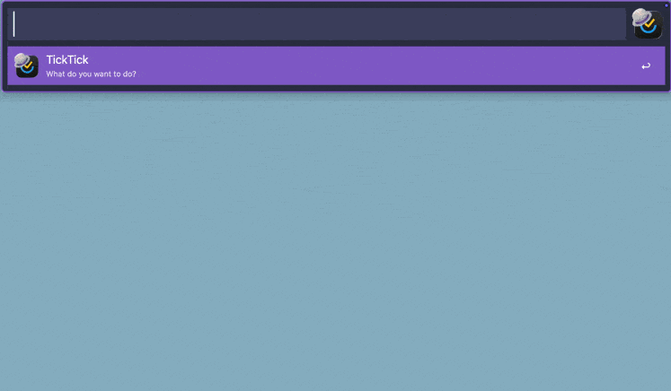
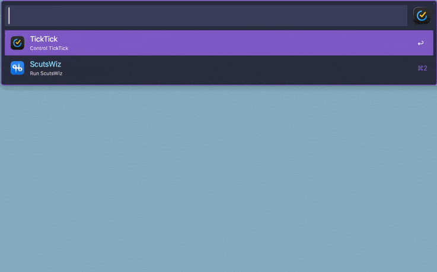
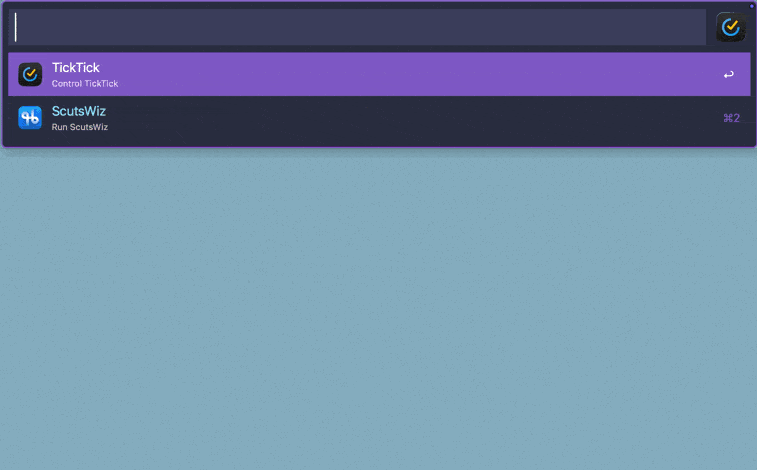
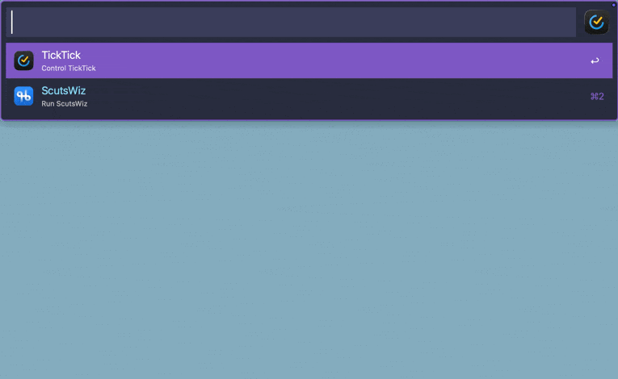
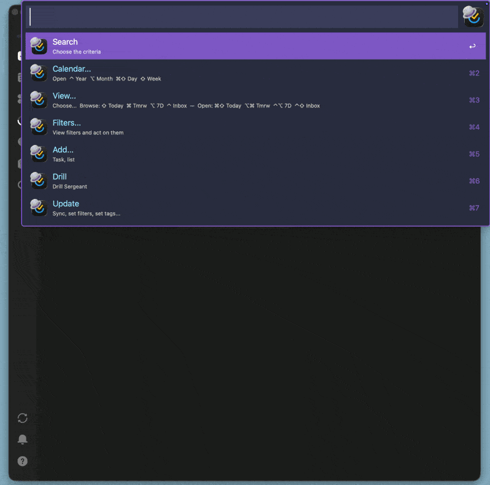
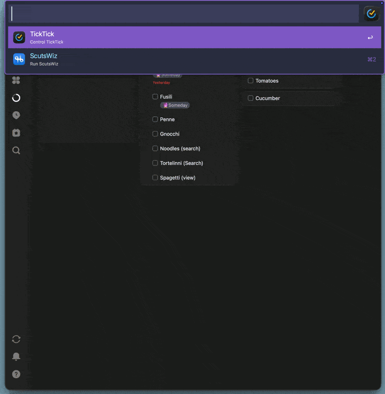
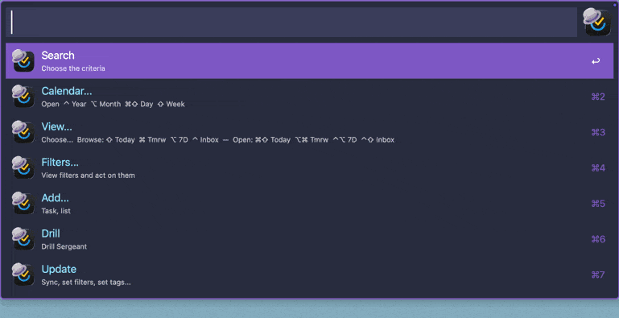
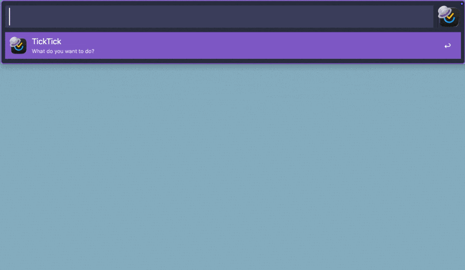
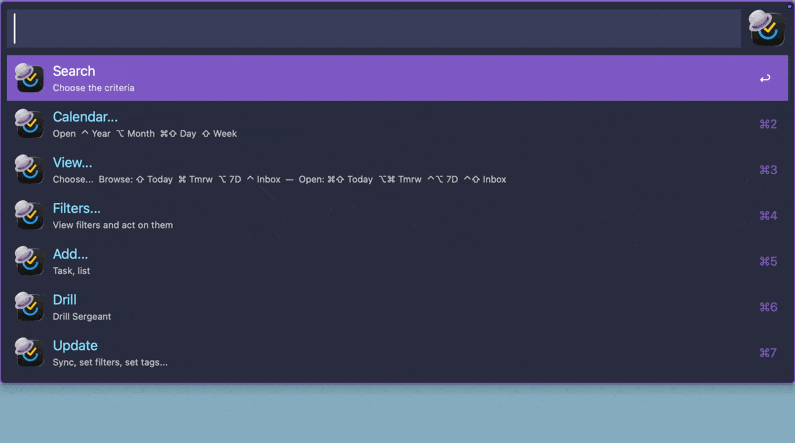

# TickAL

> Make TickTick dance with Alfred — search everything, navigate your full hierarchy, act on any result, and change task attributes without ever opening the app.

One hotkey. Every list, section, task, subtask, and note — instantly reachable and fully actionable.

> **Hotkey** is configured from inside the workflow — open it in Alfred Preferences and set it on the first node.



---

## Table of Contents

- [Requirements](#requirements)
- [Global Actions](#global-actions)
  - [Modifier Actions](#modifier-actions)
  - [Change Attributes](#change-attributes)
- [Main Actions](#main-actions)
  - [Search](#1-search)
  - [Calendar](#2-calendar)
  - [View](#3-view)
  - [Filters](#4-filters)
  - [Add](#5-add)
  - [Drill](#6-drill)
  - [Update](#7-update)
- [Cache & Sync](#cache--sync)
- [Limitations (and solutions)](#limitations-and-solutions)

---

## Requirements

- [Alfred](https://www.alfredapp.com/) with **Powerpack** licence
- **Python 3** — `/opt/homebrew/bin/python3` (install via [Homebrew](https://brew.sh))
- **TickTick** account with API access (OAuth — see setup)

---

## Global Actions

**Every modifier action is contextual and shared across *every* main action.**

---

It does not matter how you arrived at an item — which action was executed — Search, Drill, Smart list, Filter. The selected item carries its full identity: its type, hierarchy, and parent item. This is also preserved across workflow runs to enable executing multiple attribute changes on the same item in one go.

The four universal modifiers adapt to whatever is selected:

- **⌥⏎** drills *into* the selection — a list opens its tasks, a task opens its subtasks
- **⌘⏎** adds a *child* — a folder gets a new list, a list gets a new task, a task gets a subtask, a subtask gets a sub-subtask
- **⇧⌘⏎** goes *back* — returns to the previous level in Alfred, with full context intact
- **⌃⏎** acts *on* the selection — opens the attribute menu for the selected task or subtask

---

### Modifier Actions



Every task and subtask — in search, drill, smart lists, and filter results — supports the same modifiers:

| Key | Action |
|-----|--------|
| ⏎ | Open in TickTick |
| ⇧⏎ | Complete task |
| ⌘⏎ | Add subtask |
| ⌥⏎ | Browse in Alfred → Drill into subtasks |
| ⌥⌘⏎ | Copy deep link URL |
| ⇧⌘⏎ | Go back — returns to the previous Alfred panel without closing the workflow |
| ⌃⏎ | Change Attributes → [Open attribute actions](#change-attributes) |

---

### Change Attributes



Triggered with **⌃⏎** on any task or subtask, anywhere in the workflow.

#### Scheduling
- **Schedule** — add a due date (natural language) or pick from a dropdown list of predefined options
- **Reschedule** — change an existing due date; shows current date for reference
- **Unschedule** — clear the due date

Type a date and press ⏎ to confirm. On the confirm screen, select **@ Add time** to pick a specific time — choose hour (0–23), then minutes (00 / 15 / 30 / 45).

#### Tags
A consolidated tag picker shows all tags currently assigned to the task.

| Key | Action |
|-----|--------|
| ⏎ | Remove this tag |
| ⌘⏎ | Change this tag (opens replacement picker) |
| ⌃⏎ | Remove all tags |

**Adding tags:** type `# ` (hash + space) to switch to add mode. Tags accumulate — type and enter to queue multiple tags in one pass, then confirm with a single Enter. Dispatches all at once.

#### Move

Move a task to a different **list**, **section**, or **parent task** (as subtask).

| Prefix | Destination |
|--------|-------------|
| *(none)* | Another list |
| `S ` | A section within any list |
| `T ` | Another task (becomes its subtask) |

Cross-list moves are handled automatically — the task is moved to the new list before the section or parent assignment is applied.

#### Priority
Set or clear priority — High · Medium · Low · None.

#### Rename
Edit the task title inline.

#### Delete
Removes the task. Cache is updated immediately.

**Chaining:** After each attribute change, Alfred offers "Done, or change another?" — reopening the menu for the same task without returning to the hotkey.

---

## Main Actions

A single configurable hotkey launches the main menu. Type to filter any item.

---

### 1. Search



Searches **all item types simultaneously** — lists, sections, tasks, subtasks, and notes — in one query.

**Scope prefixes** narrow results to a specific type. Type a prefix followed by a space:

| Prefix | Scope |
|--------|-------|
| `L ` | Lists only |
| `S ` | Sections only |
| `T ` | Top-level tasks only |
| `TT ` | Subtasks only |
| `A ` | All tasks at any depth |
| `N ` | Notes — search by title |
| `NC ` | Notes — search by content body |

- Empty query → subtitle shows available prefix hints
- Typing a partial prefix (e.g. `t`) → matching hints appear; Enter autocompletes with trailing space
- Once `prefix + space` entered → fuzzy search runs scoped to that type

**Result display:**
- Grouped by parent list, ordered by your folder hierarchy
- Within each group: List → Section → Task → Subtask
- **Breadcrumb** in subtitle (e.g. `My List › Planning › Parent Task`) — breadcrumbs and result text do not affect fuzzy search
- **Type label** — Task · Subtask · List · Section · Note
- **Sub-item count** with type (e.g. `1 Subtask`)
- **Priority indicator** on tasks: 🔴 High · 🟠 Medium · 🟡 Low · ⚫️ None
- **Due date** — 📆 date shown when set, nothing when not set

Every result — whether a list, task, or subtask — is fully actionable without leaving Alfred. Hold a modifier key to complete a task, drill into its subtasks, add a child task, reschedule, change priority, move it to another list, or copy its deep link. Full reference: [Modifier Actions](#modifier-actions) · [Change Attributes](#change-attributes).

---

### 2. Calendar



Opens TickTick's Calendar view. Modifier keys jump directly to a specific view.

| Key | View |
|-----|------|
| ⏎ | Calendar (default) |
| ⌘⇧⏎ | Day |
| ⇧⏎ | Week |
| ⌥⏎ | Month |
| ⌃⏎ | Year |

---

### 3. View



Browse smart lists in Alfred or open them directly in TickTick.

**Single modifier — Browse in Alfred:**

| Key | List        |
| --- | ----------- |
| ⇧⏎  | Today       |
| ⌘⏎  | Tomorrow    |
| ⌥⏎  | Next 7 Days |
| ⌃⏎  | Inbox       |

**Double modifier — Open in TickTick:**

| Key | List |
|-----|------|
| ⌘⇧⏎ | Today |
| ⌥⌘⏎ | Tomorrow |
| ⌃⌥⏎ | Next 7 Days |
| ⌃⇧⏎ | Inbox |

**Also available in the View sublist:**
Today · Tomorrow · Next 7 Days · All · Completed · Inbox · Habits · Pomodoro / Focus · Eisenhower Matrix

---

### 4. Filters



Search and browse your custom filters.

- Type to search filters by name
- ⏎ — browse filter in Alfred
- ⌘⏎ — delete filter

**Browsing a filter** works in two levels — like Drill sections:

1. **Tag groups** — results are grouped by tag. Each tag appears as a selectable row showing task count, in order to mimic sections and allow browsing by them.
2. **Tasks** — select a tag to see its tasks. All [modifier actions](#modifier-actions) available. Type to fuzzy-search within that tag's tasks.

Tasks with no tag collect at the bottom under **No Tag**. Tag order follows your `tags_config.py` order, then alphabetical for any extras.

> **Note:** TickTick's API does not expose filters. Use ***Update > Set Filters*** to define yours in `filters_config.py` using the available criteria (tags, priority, due date, list, title match). Full syntax documented in the file.

---

### 5. Add


Opens directly to task creation.

**Task creation syntax:**

| Token | Purpose | Example |
|-------|---------|---------|
| `*` | Date | `*tomorrow` · `*next monday` · `*27/6` |
| `@` | Time | `@9am` · `@14:30` — opens live time picker |
| `!` | Priority | `!1` low · `!2` medium · `!3` high |
| `#` | Tag | `#work` — opens live tag picker |
| `~` | List | `~personal` — opens live list picker |
| `>` | Section | `>planning` — opens live section picker |
| `/` | Parent task | `/buy groceries` — opens live task picker (creates subtask) |

**Sub-pickers** activate as soon as the trigger character is typed — type to narrow, Enter selects and returns to the task title.

**Supported date formats:** natural language (`tomorrow`, `next monday`, `in 3 days`), numeric (`DD/MM` `DD-MM` `DD.MM`), 24-hour time.

**List creation:** Type `L ` (L + space) to switch to list creation mode — the rest becomes the new list name.

**Note creation:** Type `N ` (N + space) to switch to note creation mode — the rest becomes the new note title.

---

### 6. Drill



Navigate your full TickTick hierarchy level by level.

```
Folders → Lists → Sections → Tasks → Subtasks
```

- ⏎ on a folder expands it to show its lists
- From lists onwards: ⏎ opens in TickTick · ⌥⏎ drills deeper in Alfred
- Single-column sections are skipped automatically
- [Go Back](#go-back) available at every level
- All [modifier actions](#modifier-actions) available on every task and subtask

**Folder ordering:** The TickTick API does not expose folders. Run Update → Set Folders to define yours — use the `1) Folder Name` convention to preserve hierarchy and control display order. The number is used purely for ordering and is never displayed.

---

### 7. Update



Maintenance actions for the workflow.

- **Sync** — manually refresh the local cache from TickTick API
- **Set Filters** — define your filters (saved to `filters_config.py`)
- **Set Tags** — define your tag list (saved to `tags_config.py`)
- **Set Folders** — name your TickTick folders and set their display order
- **Open Docs** — open the workflow documentation on GitHub

> **Tip:** If data looks stale or a task is missing, run Update → Sync and retry.

---

## Cache & Sync

The workflow maintains a local cache of all TickTick data — lists, sections, tasks, subtasks, notes, tags, and filters. Results are instant; no API call is made during browsing or search.

After every modifying action (create, complete, rename, reschedule, tag, move, delete), the affected task is **updated in-place** in the cache — no full refresh, no blackout window. The next search reflects the change immediately.

**Manual sync:** Update → Sync. Recommended after bulk changes made directly in TickTick.

---

## Limitations (and solutions)

Some TickTick data is not accessible via the API. The following config files work around those limitations — each is created automatically on first use via the Update menu.

### Tags
**Problem:** The TickTick API only surfaces tags that are currently assigned to at least one active task. Tags not yet in use — or only used on completed tasks — will never appear in the picker automatically.

**Solution:** Define your tags in `tags_config.py` by running Update → Set Tags. Tags listed there always appear in the picker regardless of usage. Tags discovered from your tasks during sync are merged in automatically (case-insensitive dedup — `🔥Ongoing` and `🔥ongoing` count as one).

### Filters
**Problem:** TickTick's built-in filters are locked inside their app and cannot be read or extended via the API.

**Solution:** Define your filters in `filters_config.py` by running Update → Set Filters. Full syntax and examples are in the file header — supports `tags`, `any_tags`, `priority`, `projects`, `due`, `include`, `no_date`.

### Folders
**Problem:** The TickTick API does not expose folders.

**Solution:** Define yours by running Update → Set Folders. Use the `1) Folder Name` convention to control display order in Drill:
- `1) 1️⃣ Admin` → displays as `1️⃣ Admin`, sorts first
- `2) Work` → displays as `Work`, sorts second
- Folders without a prefix sort last, unchanged
