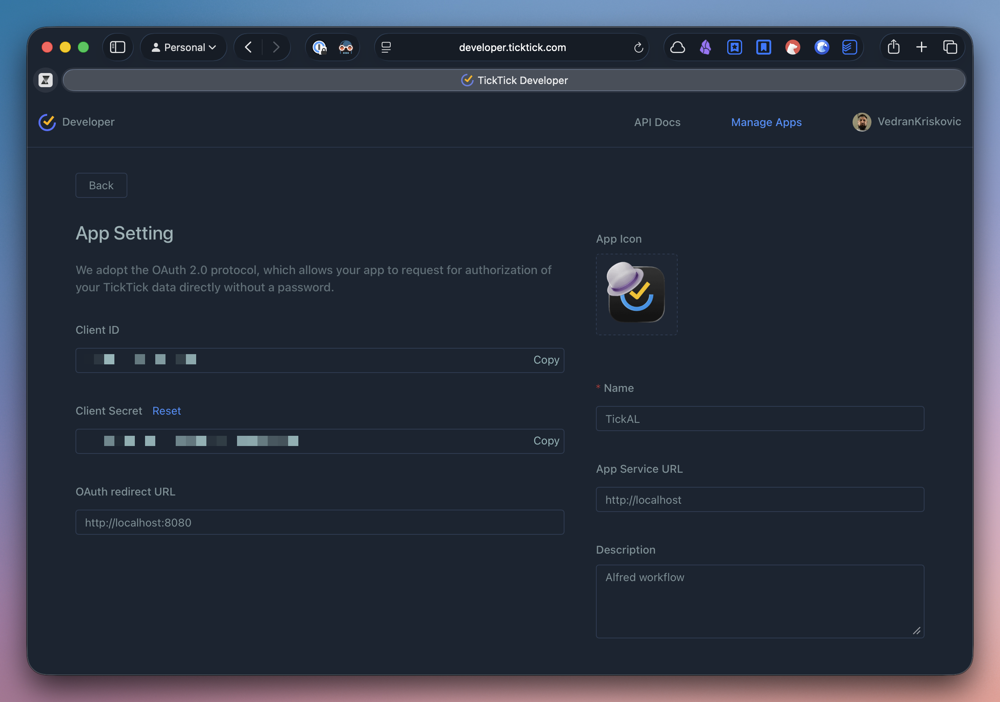
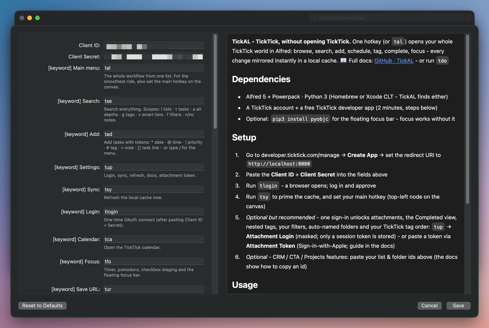
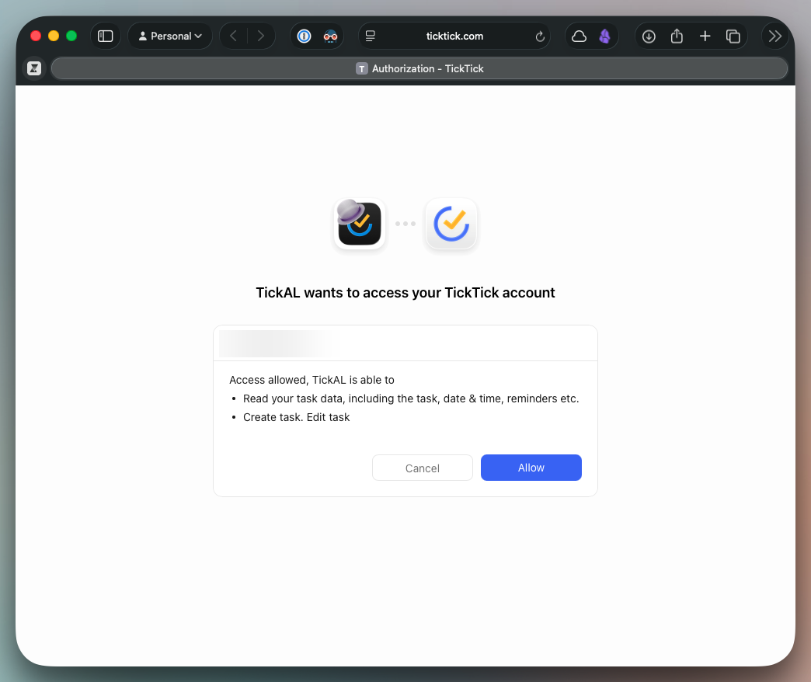
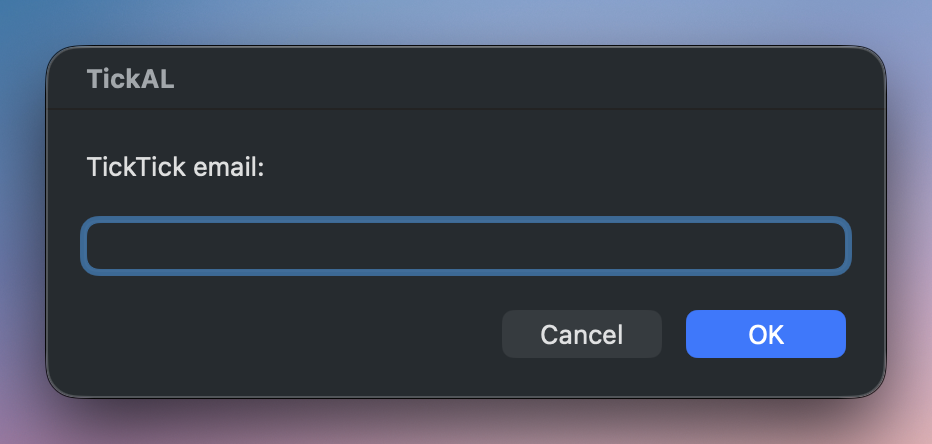

L# Setup

_TickAL docs: [Home](00-index.md) · [Setup](30-setup.md) · [Cheatsheet](95-cheatsheet.md)_

> Connect TickAL to your TickTick account, then switch on the optional extras.

**Keyword:** `tup` · **Hotkey:** (set in canvas) - opens the Settings menu (Sync · Login · Refresh TickTick · Help • TickAL Docs · Attachment Token · Attachment Login). Every "Settings → …" step below lives there.

## Requirements

| Requirement | Detail |
|---|---|
| Alfred 5 + Powerpack | Workflows need the Powerpack license |
| Python 3 | Homebrew (Apple Silicon or Intel) or the Xcode Command Line Tools. `Scripts/py.sh` resolves whichever is installed - no hardcoded interpreter. No python3 at all → an error with an install hint instead of results |
| TickTick account | Plus a free TickTick developer app (two minutes, next section) |
| PyObjC (optional) | Floating focus bar + clipboard-image attach - see [Focus bar](#focus-bar) |

## Connect

1. Open [developer.ticktick.com/manage](https://developer.ticktick.com/manage) → **Create App**. Set the redirect URI to exactly `http://localhost:8080` - TickAL captures the OAuth redirect on that port.

<details><summary>Screenshot</summary>



</details>

2. Paste the **Client ID** and **Client Secret** into Configure Workflow.

<details><summary>Screenshot</summary>



</details>

3. Run `tlogin`. A browser opens - log in and approve. TickAL exchanges the redirect code for a token and stores it.

<details><summary>Screenshot</summary>



</details>

4. Run `tsy` to prime the local cache.
5. Hotkeys - every hotkey node ships unbound (Alfred clears hotkey combos on import). Bind any you want on the workflow canvas in Alfred.

All 35 keywords are re-mappable in Configure Workflow.

## Tags & folders

There is nothing to set up. The open TickTick API never returns your tag list (tags are only discovered from tasks that carry them) and returns folders as bare group ids with no names - but with the one-time v2 token ([Attachments & Completed](#attachments--completed-v2-token) below) both heal automatically at every sync:

- **Tags** - the full list in your TickTick sidebar order (the same order that drives the app's group-by-tag sections). New tags are created right from the pickers: type a name that matches nothing and a ➕ row appears - in the `tta` tag search it can even nest the new tag under a parent.
- **Folders** - named and ordered exactly as in TickTick. (Power users: a `folders` map in `~/.ticktick_alfred/config.json` silently overrides any auto-name.)

Without the token, tags are discovered from your tasks at every sync - new tags still attach to tasks, they just won't exist as real TickTick tag entities until the app itself materialises them - and folders stay unnamed.

## Filters

Zero setup as well: your TickTick filters sync over with the token - names, sidebar order, and rules. The rules are translated into the workflow's own matcher (tags incl. parent expansion, lists and folders, keywords, due dates, priority); the rare untranslatable clause is dropped honestly, with a ⚠ note in the filter's subtitle. Browse them via the `tfi` keyword or the `f` search scope.

Tokenless (or on top of the synced ones - the cache wins when both exist): define filters by hand in a `filters_config.py` in the workflow folder - a `FILTERS` list of dicts with criteria `include`, `tags`, `any_tags`, `priority`, `projects`, `due`, plus `due_before` / `due_after` / `no_date`.

## Attachments & Completed (v2 token)

Image attachments, the Completed smart list, and the nested-tag tree use TickTick's internal v2 API, which needs a one-time session token. Two paths; both store only the token, never a password, and nothing lands in the Configure panel.

**Path A - Attachment Login** (accounts with a TickTick password):

1. Run `tup` → **Attachment Login**.
2. Enter your TickTick email in the first dialog.
3. Enter your password in the second - the field is masked; the password goes straight to TickTick's sign-in and is never written to disk.
4. Success reads "Signed in - attachments, Completed view and tag tree enabled". The session token is cached in `~/.ticktick_alfred/config.json` (owner-only, `0600`).

**Path B - Attachment Token** (Sign-in-with-Apple accounts have no password - paste the session cookie instead):

1. Log in at [ticktick.com](https://ticktick.com) in your browser.
2. Open DevTools (⌘⌥I) → **Application** → **Cookies** → `https://ticktick.com`.
3. Copy the **value** of the `t` cookie to the clipboard (a long hex string).
4. Run `tup` → **Attachment Token**. TickAL sanity-checks the clipboard, verifies the token against TickTick, and stores it in the macOS Keychain (service `ticktick_v2_token`).

Re-run either path when an attachment action reports the token expired.

<details><summary>Screenshot</summary>



</details>

## Optional ids

Three fields in Configure Workflow take 24-character TickTick ids. Leave blank if unused - the features stay dormant (CRM entry points show a single "CRM needs setup" row that opens the guide).

| Field | Enables |
|---|---|
| `crm_list_id` | The CRM booking hub via the `tcr` keyword - see [CRM](45-crm.md) |
| `cta_list_id` | The 📌 Create CTA action (the list where CTA tasks are created) |
| `projects_folder_id` | New 💼 projects land inside this folder; blank = created ungrouped |

To copy an id: open the list (or click the folder) in the TickTick **web** app and take the 24-character segment from the URL - for a list it reads `ticktick.com/webapp/#p/<id>/tasks`.

## Focus bar

The floating focus bar requires PyObjC. Install it with the workflow's own Python - a plain `pip3` may target a different Python and the bar will not appear. Homebrew Pythons are "externally managed" (PEP 668) and refuse installs without the `--break-system-packages` flag; PyObjC has no Homebrew formula, and nothing Homebrew manages depends on it, so the flag is safe here:

```
/opt/homebrew/bin/pip3 install --break-system-packages pyobjc   # Apple Silicon Homebrew
/usr/local/bin/pip3 install --break-system-packages pyobjc      # Intel Homebrew
pip3 install pyobjc                                             # no Homebrew (Xcode CLT Python)
```

Every other focus feature - timer, pomodoro, staging blocks, sweep - works without it. If PyObjC is missing when a focus session runs, a reminder notification fires ("Focus bar needs PyObjC"), at most once an hour. Clipboard-image attach shares the PyObjC dependency - see [Notes, links & images](46-notes-links-images.md).

## Hourly background sync

Optional. Writes already patch the cache in place and `tsy` does a full refresh any time; a LaunchAgent adds an hourly refresh on top. The template ships in the repo at `assets/launchd/com.vex.tickal.cachesync.plist` (repo only, not in the workflow bundle):

1. Copy it to `~/Library/LaunchAgents/`.
2. Edit the paths inside - the python3 in `ProgramArguments`, plus the script path and `WorkingDirectory` - to point at your installed workflow folder (Alfred → Workflows → right-click TickAL → Open in Finder).
3. Load it: `launchctl load ~/Library/LaunchAgents/com.vex.tickal.cachesync.plist`

It runs `src/sync.py sync` hourly and at load; logs go to `/tmp/tickal_cachesync.log`.

```sh
cp assets/launchd/com.vex.tickal.cachesync.plist ~/Library/LaunchAgents/
# Edit ~/Library/LaunchAgents/com.vex.tickal.cachesync.plist:
#   point the python3, sync.py and WorkingDirectory paths at YOUR
#   installed workflow folder (Alfred → Workflows → right-click → Open in Finder)
launchctl load ~/Library/LaunchAgents/com.vex.tickal.cachesync.plist
```

## Related

- [Getting started](10-getting-started.md) - the same journey as a guided walkthrough
- [Settings & sync](90-settings-sync.md) - the Settings menu and cache behavior
- [CRM](45-crm.md) - what `crm_list_id` unlocks
- [Troubleshooting](99-troubleshooting.md) - login, token, and cache errors
