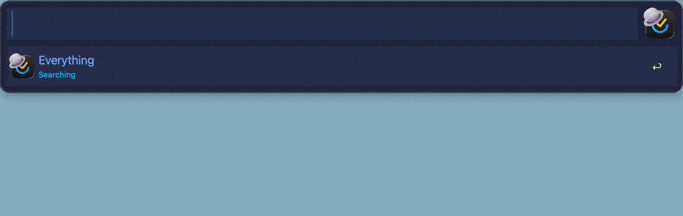

# Browse & Views

_TickAL docs: [Home](00-index.md) · [Setup](30-setup.md) · [Cheatsheet](95-cheatsheet.md)_

> Open Today, Tomorrow, the week, the Inbox, the buffer, or your tags as live Alfred lists - and walk any list down to sub-subtasks without touching the mouse.



**Keywords:** `tod` · `tom` · `tne` · `tin` · `tbu` · `tta` - remap any of them in Configure Workflow.

## View keywords

| Keyword | Opens |
|---------|-------|
| `tod` | Today |
| `tom` | Tomorrow |
| `tne` | Next 7 days |
| `tin` | Inbox |
| `tbu` | 🅿️ Buffer |
| `tta` | Tags - search pre-scoped to `g` |

Every task view is a plain list: typing filters it, and every row carries the full chord set below (Tags opens on tag rows first - see [Tags](#tags)). Hotkeys for these views ship unbound - assign keys in Alfred's workflow editor. The full smart-list family (Completed, Habits, Summary, …) lives in [Search](40-search.md) under the `v` scope, via the `tsl` keyword.

## The drill ladder

```
Folders ─⌥→ Lists ─⌥→ Tags ─⏎→ a tag's tasks
                └─⌥⇧→ Sections ─⌥→ Tasks ─⌥→ Subtasks ─⌥→ Sub-subtasks
```

- **⌥⏎ goes one level deeper.** On a list row, deeper forks: ⌥⏎ opens the list's tag picker, ⌥⇧⏎ its section picker - same fork on list rows in search.
- **Drill is offered only when the row has something under it** - a task with no open subtasks shows no ⌥⤵️ hint and ⌥⏎ does nothing.
- **Sections auto-skip.** A list with no sections (or only unsectioned content) renders its tasks directly.
- **📋 Show all tasks** tops both pickers - ⏎ shows the whole list flat, grouped by tag in your TickTick tag order (the same order that drives the app's group-by-tag sections), priority first. Typing filters it like any level.
- **Priority floats up.** Every list, section, and tag view sorts 🔴 high → 🟠 → 🟡 first, keeping your TickTick order within each band.
- **The 📥 Inbox row** on the folder screen drills straight to its tasks.
- **⌥⌘⏎ on a folder row** copies the folder id - for `projects_folder_id` in Configure Workflow ([Setup](30-setup.md#optional-ids)).
- **Entry points:** the view keywords above, or ⌥⏎ on any list, section, task, or smart-list row in search via the `tse` keyword.

Each row's subtitle advertises exactly the chords it supports (⏎↗️ ⌘⚡ ⌥⤵️ ⌃🔙 …), so the ladder is self-documenting.

## Typing filters the level

The query bar never carries navigation state - context rides invisibly behind the scenes. Whatever you type fuzzy-filters the current screen; clear it and the full level returns.

## One chord back: ⌃⏎

⌃⏎ is the only back key, everywhere. Where it lands:

| From | ⌃⏎ lands on |
|------|-------------|
| Tasks | Section picker - or the list picker when the list has no sections (mirrors the auto-skip) |
| Subtasks | The list's tasks |
| Sub-subtasks | The parent task's subtasks |
| A tag's tasks | The list's tag picker |
| Tag picker | The list picker |
| Lists | Folder picker |
| Buffer | Folder picker |
| A search result | Main menu |

Today, Tomorrow, Next 7 Days, Inbox, and the folder picker are the top of their ladders - ⌃⏎ there does nothing; ⌫ or a fresh keyword leaves them.

## Row chords

Every task row in every view supports:

| Chord | Does |
|-------|------|
| ⏎ | Open in TickTick |
| ⌥⏎ | Drill into subtasks |
| ⌘⏎ | Open the [Actions](43-actions.md) menu |
| ⌃⏎ | Back one level |
| ⇧⏎ | Complete the task |
| ⌥⌘⏎ | Copy the task's link |
| ⌥⇧⏎ | Add to the 🅿️ buffer |

## Tags

Via the `tta` keyword - search pre-scoped to `g`. Every tag appears with its open-item count (zero-count tags included); ⏎ advances to that tag's items, ⌘⏎ opens the tag's Actions menu, ⌥⌘⏎ copies the tag's web-app link. ⏎ on a parent tag lists its child tags instead. Per-list tag pickers open with ⌥⏎ on any list row.

Tag screens filter tasks while typing: matching tagged tasks follow the tag rows, so you can reach a task directly without picking a tag first. Clearing the query restores the pure tag list. The same applies on a list's tag picker in the drill ladder - typing there also matches the list's tasks.

## Buffer 🅿️

⌥⇧⏎ on any task row - in a view, the drill ladder, or search - queues it into the buffer. Buffered tasks show a 🅿️ suffix in their title everywhere. Open the queue via the `tbu` keyword; typing filters it like any other level.

⌘⏎ on a buffered row opens the batch menu:

| Row | Does |
|-----|------|
| 🏷️ Tag all… | Add tags to every buffered task |
| 📁 Move all… | Move all to another list |
| ✔️ Complete all | Complete all |
| ⚡ Priority all… | Set priority on all |
| 🎯 Add buffer to focus | Stage all into the focus task's today block, then clear (shown only during a task [focus session](46-focus.md)) |
| 🎯 Merge/Stage for Focus | Stage THIS row under another task or into a note - the task menu's own flow |
| 🗑️ Remove this | Drop the selected task from the buffer |
| 🧹 Clear buffer | Empty the buffer without touching the tasks |
| 🗑️ Delete all | Move all buffered tasks to TickTick's Trash - type-to-confirm |

Tasks completed or deleted after queueing drop out of the buffer silently.

## Related

- [Search](40-search.md) - the `tse` scopes, including `g` (tags) and `v` (smart lists)
- [Actions](43-actions.md) - everything behind ⌘⏎
- [Focus](46-focus.md) - where "Add buffer to focus" sends the queue
- [Concepts](20-concepts.md) - drill, buffer, and scope terminology
