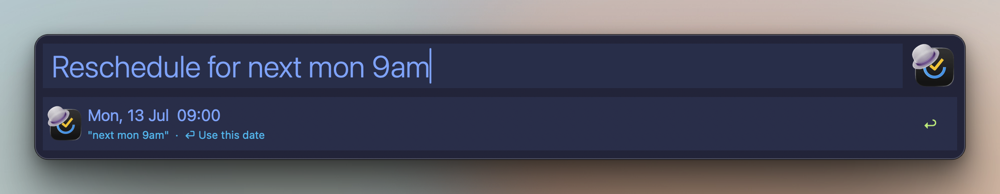
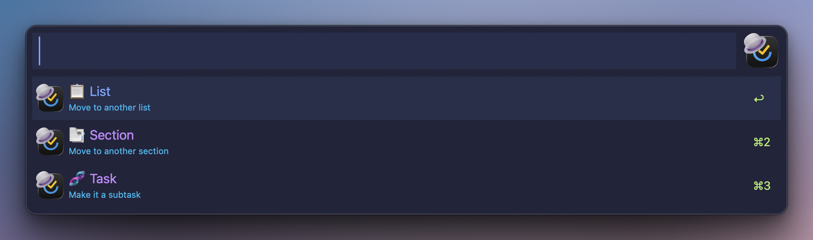

# Actions

_TickAL docs: [Home](00-index.md) · [Setup](30-setup.md) · [Cheatsheet](95-cheatsheet.md)_

> Every operation on a selected item - schedule, tag, move, focus, delete - from one filterable menu.

**Keyword:** none - press ⌘⏎ on any row in any search or browse view.

## Opening the menu

⌘⏎ on a row opens its Actions menu. The menu is itself a filter: type to narrow the rows (`sch`, `move`, `del`). ⌃⏎ goes back to where you came from - from the menu and from every picker inside it. Rows with a current value (schedule, tags, priority, location, title) show that value as the row title, so the menu doubles as a task inspector.

While a focus timer runs, a `⏹ Stop focus` row (task name + elapsed minutes, ⏸ when paused) sits on top of every item menu (task/subtask/note/list/section - not the tag, smart-list, or buffer menus) - ⏎ stops and logs to the TickTick calendar, ⌥⏎ stops without logging.

Screenshot

## The matrix - rows by item type

Task / subtask / note share one row set; lists and sections get the container subset. Conditional rows appear only when their condition holds.

| Row | Effect | Task | Subtask | Note | List | Section |
|---|---|:-:|:-:|:-:|:-:|:-:|
| ↗️ Open | Open the item in TickTick | ✓ | ✓ | ✓ | ✓ | ✓ |
| ⤵️ Browse subtasks | Drill into open subtasks (only if any) | ✓ | ✓ | ✓ | | |
| ⤵️ Browse sections | Drill into the list's sections | | | | ✓ | |
| 🏷️ Browse tags | Drill into the list's tags | | | | ✓ | |
| ⤵️ Browse tasks | Drill into the section's tasks | | | | | ✓ |
| 📅 _current date_ | Schedule… (date/time/duration picker) | ✓ | ✓ | ✓ | | |
| 🔔 Reminder | Set a reminder… | ✓ | ✓ | ✓ | | |
| 🏷️ _current tags_ | Tags… (view/add/remove/change) | ✓ | ✓ | ✓ | | |
| 📌 Create CTA / 🔥 Add Prepare | Dynamic follow-up row - see [Projects](49-projects.md) (CTA) and [CRM](45-crm.md) (Prepare); needs its id set in Configure Workflow | ✓ | ✓ | ✓ | ✓ | |
| ⚫️/🟡/🟠/🔴 _current_ | Priority… | ✓ | ✓ | | | |
| _list>section_ | Move… (list / section / re-parent) | ✓ | ✓ | ✓ | | |
| ➕ Add task | Add a subtask (task-like) or a task into the container | ✓ | ✓ | ✓ | ✓ | ✓ |
| 🔗 Copy link | Copy the item URL | ✓ | ✓ | ✓ | ✓ | ✓ |
| 📂 Go to list | Open the parent list in TickTick | ✓ | ✓ | ✓ | | |
| 🌐 Open link | Open a link found in the title/description (only if any) | ✓ | ✓ | ✓ | | |
| 📝 Note | View/edit the description in a text editor | ✓ | ✓ | ✓ | | |
| 🖼️ Add image | Attach the clipboard image (needs the [v2 token](30-setup.md)) | ✓ | ✓ | ✓ | | |
| 🔃 Convert to note / task | Flip the item's kind - title, dates and tags survive | ✓ | ✓ | ✓ | | |
| 🎯 Focus | Timer or pomodoro on this task - see [Focus](44-focus.md) | ✓ | ✓ | ✓ | | |
| 🗒️ Sticky note | Pin the task to the desktop as a TickTick sticky | ✓ | ✓ | ✓ | | |
| 🅿️ Add to buffer | Queue for batch actions (same as ⌥⇧⏎ on the row) | ✓ | ✓ | ✓ | | |
| 🎯 Add to focus (…) | → checkbox in the running focus task's today block (only while a task-bound session runs; hidden on the focus task itself) | ✓ | ✓ | ✓ | | |
| 🎯 Stage for Focus | Checkbox-link this task into another task/note | ✓ | ✓ | ✓ | | |
| 🔗 Link to running focus | Attribute an unattributed running session to this task | ✓ | ✓ | ✓ | | |
| ✔️ Complete | Mark done | ✓ | ✓ | | | |
| 🚫 Won't do | Abandon - off every list, kept on record (see below) | ✓ | ✓ | | | |
| _title_ Rename… | Rename the item | ✓ | ✓ | ✓ | ✓ | |
| 🗑️ Delete | Delete (lists: typed confirm, see below) | ✓ | ✓ | ✓ | ✓ | |
| 🔙 Go back | Back to search | ✓ | ✓ | ✓ | ✓ | ✓ |

Notes never show Priority or Complete. Deleting a list is guarded: the `🗑️ Delete list` row autocompletes the query to `delete list yes`, and only then does the valid confirm row appear - the list and its tasks move to TickTick's Trash.

**Typed shortcuts** inside the menu: `pomo 45` starts a 45-minute pomodoro on the task; `log 25` writes a 25-minute focus record ending now.

## Tag, smart-list, and buffer menus

⌘⏎ works on non-task rows too, with smaller menus.

**Tag row** (from search's tag scope or a tag drill):

| Row | Effect |
|---|---|
| ↗️ Open tag | Open the tag in the TickTick web app |
| ⤵️ Browse tag tasks | Drill into the tag's tasks |
| ➕ Add task | New task pre-tagged with this tag |
| ➕ Add nested tag | New child tag under this one - a dialog asks the name (top-level tags only; needs the [v2 token](30-setup.md)) |
| 🎯 Send all to focus | Every open tagged task → the focus task's today block (only during a task-bound session) |
| 🔗 Copy link | Copy the tag URL |
| 🗑️ Delete tag | Remove the tag everywhere - the tasks that carried it survive |
| 🔙 Go back | Back to search |

**Smart-list row** (Today, Tomorrow, Next 7 days, Inbox…):

| Row | Effect |
|---|---|
| 🎯 Send all to focus | Every task in the view → the focus task's today block, in view order (Today / Tomorrow / Next 7 days / Inbox, during a task-bound session) |
| ↗️ Open in TickTick | Open the view in the app |
| 🔙 Go back | Back to search |

**Buffer row** (inside the buffer view, via the `tbu` keyword - batch actions on everything queued):

| Row | Effect |
|---|---|
| 🏷️ Tag all… | Add tags to all buffered tasks |
| 📁 Move all… | Move all to another list |
| ✔️ Complete all | Complete all |
| ⚡ Priority all… | Set priority on all |
| 🎯 Add buffer to focus | All → the focus task's today block, then clears the buffer |
| 🗑️ Remove this | Drop the selected task from the buffer |
| 🧹 Clear buffer | Empty the buffer (tasks untouched) |
| 🗑️ Delete all | Typed confirm - autocompletes `delete all yes`, then ⏎; tasks move to TickTick's Trash |
| 🔙 Go back | Back |

## Pickers

Every picker reads the task context from the menu row; ⌃⏎ inside any picker returns to the Actions menu.

### Schedule

Three screens in one flow:

| Screen | Input | Result |
|---|---|---|
| Date | Shortcut rows, or type natural language: `tomorrow`, `21/07`, `next monday`, `in 3 days`, `end of june` | ⏎ commits the date |
| Confirm | ⏎ sets the date; `@` adds a time | Hour picker (0-23), then minutes (00/15/30/45) |
| Duration | `>` after a time; type an end time (`14:30`) or a length (`2h`, `90m`, `1h30`) | Sets a start→end span |

`%` adds reminders anywhere in the flow once a date is set - presets or custom offsets, multiple allowed. A dated task also gets a `Clear date` row on the first screen.

Screenshot

### Reminder

Adds a reminder to the task (deduped; the task needs a date to fire). Presets: at time · 5 · 15 · 30 min before · 1h · 1d · 2d · 3d · 7d before · day-of 7am (all-day tasks). Free-typed offsets work too: `45`, `2h`, `3d`. The open API cannot remove the last reminder - clear that one in the TickTick app.

### Tags

Default view lists the task's current tags: ⏎ removes the selected tag, ⌘⏎ swaps it for another, ⌥⏎ clears all. Type `# ` to enter add mode - a multi-pick queue: ⏎ queues a tag, typing filters, and the top row commits the whole batch at once. Parent tags are drill rows (⏎ shows their children; parents themselves are never assigned). On the CRM list the picker scopes to the 🔥 booking tags.

### Priority

Four rows: 🔴 High · 🟠 Medium · 🟡 Low · ⚫️ No priority.

### Move

Empty query shows a scope menu; a prefix letter drills into that sub-picker (no prefix filters lists):

| Prefix | Scope | Result |
|---|---|---|
| `l` | 📋 List | Move to another list |
| `s` | 📑 Section | Move to a section in any list (rows read `Section \| List`) |
| `t` | 🧬 Task | Re-parent - make it a subtask of another task |

Screenshot

### Rename

Type the new title, ⏎ confirms. Works on tasks, subtasks, notes, and lists.

### Note

Opens the description (markdown) in an editable text view; ⏎ saves it back to TickTick.

### Add image

Uploads the clipboard image (e.g. a screenshot) as a real TickTick attachment - it renders inline on the task and syncs everywhere. Requires the one-time v2 session token from [Setup](30-setup.md); without it the action prints a pointer to the Settings rows.

### Convert to note / task

One dynamic row: on a task it reads **🔃 Convert to note**, on a note **🔃 Convert to task**. The item keeps its title, description, dates, and tags - only the kind flips, and the search screens pick the change up immediately.

### Won't do

TickTick's third status: **🚫 Won't do** takes the task off every open list without pretending it was done. It shows up in the app's own Won't Do view and in TickAL's `v` scope (**🚫 Won't Do** smart list, where ⇧⏎ reopens it). If the abandoned task is the one your focus session is running on, the session stops and logs once the abandon sticks - same guard as Complete. Needs the [v2 token](30-setup.md) (the row points you at Settings without it).

### Open link

If the title holds exactly one link and the description none, ⏎ opens it directly (⌘⏎ copies the URL instead). Otherwise a picker lists every link found in the title and description - any scheme (`https`, `obsidian://`, `file://`, `ticktick://`).

## Act again

Attribute changes loop back: after schedule, reminder, tags, priority, move, rename, or copy link, the Actions menu reopens on the same task with fresh values on every row - chain edits without re-searching. A move follows the task to its destination list; a subtask added from the menu reopens the parent's menu (a CRM booking opens the Prepare window instead - see [CRM](45-crm.md)). Esc dismisses. Open, complete, delete, note edits, image attach, and list renames end the loop.

## Related

- [Search](40-search.md) - where you press ⌘⏎
- [Browse & drill](41-browse-drill.md) - ⌥⏎ / ⌃⏎ navigation
- [Focus](44-focus.md) - the 🎯 rows in depth
- [Projects](49-projects.md) - the 📌 Create CTA row in full
- [CRM](45-crm.md) - the 🔥 Prepare variant of the same row
- [Cheatsheet](95-cheatsheet.md) - everything on one page
