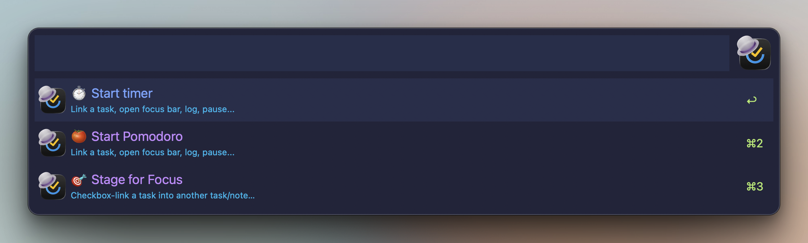

# Focus

_TickAL docs: [Home](00-index.md) · [Setup](30-setup.md) · [Cheatsheet](95-cheatsheet.md)_

> Run timers and Pomodoros on TickTick tasks, stage a day's checkbox worklist inside the focused task, and drive the session from a floating desktop bar.

**Keyword:** `tfo` (`tfo [timer|pomo] [link <task>]` — every row advances the query bar itself; ⌃⏎ backs out to the main menu)

## Start

The idle screen offers two modes plus the stage flow:

| Row | What runs |
|---|---|
| ⏱️ Start timer | TickAL's own timer — pause/resume, logs a focus record on stop |
| 🍅 Start Pomodoro | TickTick's real pomodoro; length follows the app's own pomo setting |
| 🎯 Stage for Focus | Pick a task, then checkbox-link it into another task/note — the same flow as the ⌘ row ([Staging](#staging) below) |

Each mode then offers **▶️ Start timer** / **▶️ Start Pomo** immediately (no task) or **🔗 Link a task** — fuzzy search over open tasks, then start plain or with the sticky variant (**🗒️ Start + sticky note** on the timer, **🗒️ Sticky note + pomo** on the Pomodoro — the task opens as a desktop sticky). Pomodoro rows read "+ open", not "for": the app's pomodoro does not bind to a selection, so TickAL selects the task in the app and tracks the binding itself.

One session at a time. Starting on a different task first closes the previous timer in full (sweep + note + record). An unattributed session can be linked later — the **🔗 Link a task** row on the running screen attributes it live, or attribute at the end via `stop link <task>`.

**The for-flow.** ⌘⏎ on any task row → **🎯 Focus** opens the same two-mode screen pre-bound to that task — timer or pomodoro, each plain or with the sticky.

While a session runs, `tfo` shows the session screen: status + elapsed time, **⏹️ Stop & log**, **⏸️ Pause** / **▶️ Resume**, **➕ Add to focus**, **📥 Add buffer (n)**, **🧹 Sweep**, **📋 Copy as bullet list** (today's unticked checkboxes → clipboard as paste-ready `- Title` lines), **👁 Show bar** / **🫥 Hide bar**, **🚮 Discard** (stop without logging). Typing filters the rows. A dormant hotkey for Focus ships unbound — bind it in Alfred; the keyword is re-mappable in Configure Workflow.

<details><summary>Screenshot</summary>



</details>

## The bar

A floating always-on-top pill follows every session. It is the one focus feature that needs PyObjC (`pip3 install pyobjc`) — everything else works without it, and a hint notification fires (at most hourly) if it is missing.

| Control | Action |
|---|---|
| ● | Complete the focused task — stops and logs the session first |
| Title | Open the task in TickTick (hover shows the full name) |
| Clock | Elapsed time; pomodoros count down |
| ⏸ / ▶ | Pause / resume |
| ⏹ | Stop & log |
| 🗒 | Open the task's sticky note |
| 🌬 | Sweep — ticked checkboxes complete for real, right from the bar |
| ⌄ | Expand / collapse the full checkbox list |
| − | Hide the bar — the session keeps running |

The second row shows the first unchecked checkbox of today's block plus a done/total counter. Click the ○ to tick it — confetti fires, the row leaves the bar (the description keeps the ticked line), and the real task completes on sweep or stop. Expanded, every unchecked checkbox is listed; each row ticks or opens its task, the ⤒ ↑ ↓ ⤓ buttons reorder it inside the block (one slot, or straight to the top/bottom), and past 10 rows the list scrolls with the wheel (a "scroll ↑/↓" strip shows what's off-screen). Drag the bar background to reposition; the position persists. A hidden bar returns via **👁 Show bar** in `tfo`, and a new session re-shows it automatically. Unattributed sessions render a clock-and-controls-only bar.

<details><summary>Screenshot</summary>


</details>

## Staging

Staging turns tasks into checkbox links inside another task's description. ⌘⏎ on a task → **🎯 Stage for Focus** (or the 🎯 row on the `tfo` menu, which asks for the task first):

| Branch | Direction |
|---|---|
| ⤴️ Out | Make this task a checkbox link in another task or note |
| ⤵️ In | Make other tasks checkbox links in this task |

The In branch multi-picks: each ⏎ queues a title (separated by ` | ` in the query bar), the **✅ Add N checkboxes** row commits all of them in one write. When a session is running, the stage screen adds **🎯 Add to current focus** as a shortcut.

During a session, **➕ Add to focus** on the `tfo` screen searches open tasks and stages straight into the focus task's today block — already-staged tasks show a 🎯 suffix. Typing `/` there opens the **bulk scope**: 🏷 Add tagged (pick a list, then one of its tags), 📑 Add section, or 📅 Add today — the whole set lands in the block in one ⏎. A brand-new task can skip the search entirely: the add window's `/` menu offers **🎯 Stage for Focus** and **➕ Add to focus** rows that chain the task into focus right after it is created ([Add](42-add.md)). The 🅿️ buffer feeds staging too: collect tasks anywhere with ⌥⇧⏎, then **📥 Add buffer (n)** in `tfo` (or **🎯 Add buffer to focus** in the buffer's ⌘ menu, via the `tbu` keyword) empties the buffer into the block in buffer order.

## Checkbox blocks

Staged tasks live as dated blocks at the top of the focus task's description, above the original text:

```markdown
### 2026-07-07
- [ ] [Task A](https://ticktick.com/webapp/#p/<listId>/tasks/<taskId>)
- [x] [Task B](https://ticktick.com/webapp/#p/<listId>/tasks/<taskId>)
---
### 2026-07-05
- [x] [Task C](https://ticktick.com/webapp/#p/<listId>/tasks/<taskId>)
---
Original description — never touched.
```

| Rule | Behavior |
|---|---|
| Anatomy | `### YYYY-MM-DD` header, `- [ ] [Title](url)` lines, `---` separator; newest block first |
| Carry-over | Creating today's block moves every unchecked line from older blocks into it |
| Checked lines | Immortal — never moved, removed, or rewritten; they stay under the day they were done |
| Dedupe | A task already unchecked in today's block is not added twice; checked occurrences do not prevent re-adding |
| Original description | Always preserved verbatim below the blocks |

Because blocks are plain Markdown in the task description, they render as real checkboxes in TickTick itself and in sticky notes — ticks made there merge cleanly with the workflow's writes.

## Sweep & the focus record

**Sweep** completes the real tasks behind ticked boxes. **🧹 Sweep** on the `tfo` screen runs it on demand: every checked, linked, still-open checkbox task across ALL of the focus task's blocks gets completed. The lines themselves stay — the block is the permanent record.

**⏹️ Stop & log** runs the full end-of-session bundle: sweep, then today's block is captured verbatim as the focus record's note, then a duration-true focus record (pauses compressed out) lands in TickTick. If the record fails to post, the timer stays alive — stop again to retry, or **🚮 Discard**. `stop link <task>` on an unattributed session logs the record onto the picked task instead.

## Completing the focused task

Completing the focused task ends its session. Complete it anywhere — ⇧⏎ on its row, the ⌘ Actions menu, or a buffer complete-all — and the timer session stops and logs too: via ⇧⏎ or the ⌘ menu the session closes first (sweep + note + record land while the task is still open), then the complete goes through; a buffer complete-all logs the session right after its completes. The bar's **●** button is the same flow one click away; on a Pomodoro session it also ends the running pomodoro before completing the task (a plain ⇧⏎ complete leaves the app's pomodoro running by design).

## Related

- [Setup](30-setup.md) — OAuth, cache, optional PyObjC
- [Actions](43-actions.md) — the ⌘ menu the 🎯 Focus and Stage rows live in
- [CRM](45-crm.md) — the other flagship flow
- [Cheatsheet](95-cheatsheet.md) — every keyword and chord on one page
