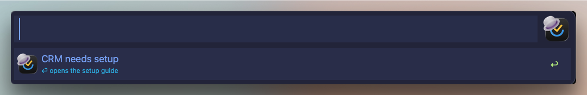
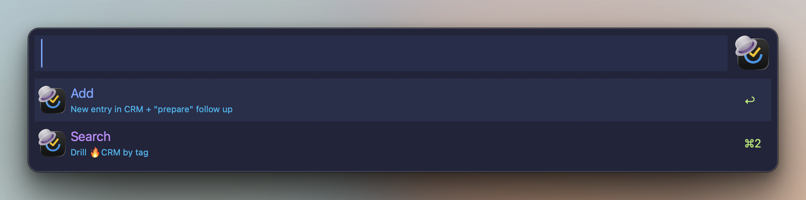

# CRM

_TickAL docs: [Home](00-index.md) · [Setup](30-setup.md) · [Cheatsheet](95-cheatsheet.md)_

> Run a bookings pipeline out of one TickTick list: tagged bookings, auto-attached reference images, and an automatic "Prepare" follow-up per booking.

**Keyword:** `tcr` · **Hotkey:** (set in canvas) - opens the CRM hub (two rows: Add / Search; type `a` or `s` to pick).

An honest note first: the CRM is the most opinionated part of TickAL. It was built for a real booking business and hard-codes that shape - one bookings list, the 🔥 tag group, a prepare-before-the-appointment ritual. If your work fits that shape, it is the fastest surface in the workflow. If not, skip this page; nothing else depends on it.

## Setup

The CRM is dormant until `crm_list_id` is set in Configure Workflow. Until then, every CRM entry point renders a single **CRM needs setup** row - ⏎ on it opens this page.

<details><summary>Screenshot</summary>



</details>

To configure it:

1. Create (or pick) the TickTick list that will hold bookings.
2. Copy its id without leaving Alfred: find the list (`tse l <name>`) → ⌘⏎ → **🆔 Copy id**.
3. Paste it into `crm_list_id` in Configure Workflow.
4. Create the 🔥 tags in TickTick (see [the 🔥 tag group](#the--tag-group)) - CRM pickers offer only those.

Image auto-attach additionally needs the one-time v2 session token - see [Setup](30-setup.md).

## The hub

`tcr` (or the "📈 CRM..." main-menu row) opens a two-row hub pinned to your CRM list:

| Row | What it does |
|---|---|
| **Add** | New booking in the CRM list - image auto-attach, scoped pickers, Prepare follow-up on create |
| **Search** | Drill the CRM list by tag |

⌃⏎ goes back to the main menu.

<details><summary>Screenshot</summary>



</details>

## Adding a booking

**Add** opens the normal Add window (all tokens work - see [Add](42-add.md)) pinned to the CRM list, with three CRM-specific behaviours:

| Behaviour | Detail |
|---|---|
| Clipboard image auto-attach | If the clipboard holds an image when you create the booking, it uploads as an attachment (the reference-image step). Never fires on a 🔥prepare follow-up. Needs the v2 token; without one the task is still created and the notification says why the image wasn't attached. |
| Scoped `[[` picker | The `[[` task-link picker offers only open CRM bookings (🔥prepare follow-ups excluded), not your whole account. |
| Scoped `#` picker | The tag picker offers only the 🔥 tag group - nothing else belongs on a booking. |

A plain `tad` add whose `~l` resolves to the CRM list gets the same `[[` scoping and image auto-attach - the hub is a shortcut, not a separate engine.

## The 🔥 tag group

Every booking carries a status tag from the group. They are plain TickTick tags - create them once and the CRM pickers surface them.

| Tag | Role |
|---|---|
| `🔥lead` | Booking tag - inquiry, not yet committed |
| `🔥consultation` | Booking tag - consult scheduled |
| `🔥tattoo` | Booking tag - the appointment itself |
| `🔥ongoing` | Booking tag - multi-session client |
| `🔥prepare` | Follow-up tag - applied automatically, never a booking |

The booking-vs-follow-up split keeps the automation loop-proof: only the four booking tags trigger a follow-up, and the follow-up itself carries none of them.

## The automatic Prepare follow-up

Creating a CRM task with a booking tag immediately re-opens the Add window prefilled:

```
~l 🔥CRM #🔥prepare Prepare for [[booking title]]
```

Schedule it (`*` / `@`) and ⏎ - the `[[…]]` resolves to a real link back to the booking on create. Every booking gets a linked, schedulable prep task with zero extra keystrokes. Non-booking CRM adds and the follow-up itself never re-trigger the flow.

The ⌘ Actions menu on any CRM booking also offers a manual **🔥 Add Prepare** row that opens the same prefill.

## Searching bookings

**Search** opens the tag drill scoped to the CRM list. Only tags from the 🔥 group surface - bookings often carry extra people/place tags that would clutter the pipeline view.

| Key | On a tag row |
|---|---|
| ⏎ | Drill into that tag's bookings |
| ⇧⌘⏎ | New booking pre-tagged with it |
| ⌃⏎ | Back |

Booking rows inside the drill behave like every other task list: ⏎ open, ⌘⏎ actions, ⌥⏎ subtasks, ⇧⏎ complete.

## Related

- [Setup](30-setup.md) - Configure Workflow, the v2 token for image attachments
- [Add](42-add.md) - the token grammar behind the booking window
- [Browse & drill](41-browse-drill.md) - the drill ladder the Search row lands in
- [Projects](49-projects.md) - the 📌 Create CTA sibling of the Prepare row
