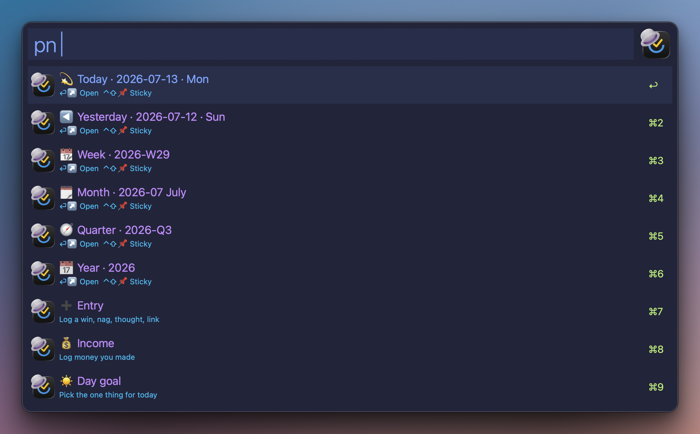
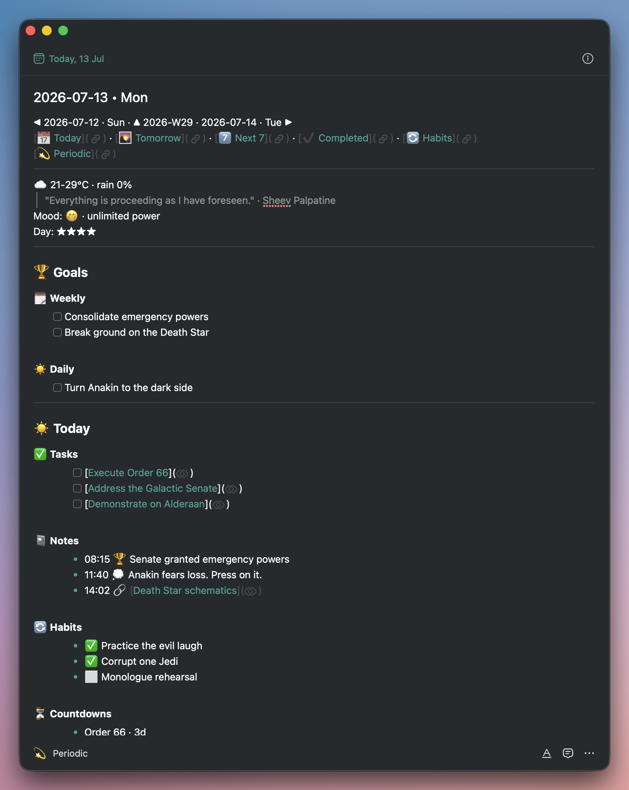

# 💫 Periodic notes

_TickAL docs: [Home](00-index.md) · [Setup](30-setup.md) · [Cheatsheet](95-cheatsheet.md)_

> Obsidian-style daily, weekly, monthly, quarterly and yearly notes - minted, refreshed and rolled up for you, inside TickTick.

**Keyword:** `tpn` · **Hotkey:** (set in canvas) - or the `pn` scope inside search (`tse pn …`, or `/pn` anywhere in the bar), or the **💫 Periodic Notes** row in the main menu (`tal`). Typing `daily note`, `weekly note` (or just `weekly`, `monthly`…) anywhere in search also surfaces the matching note. Or jump straight in with a direct keyword - see [Direct keywords](#direct-keywords).

If you keep periodic notes in Obsidian, you know the concept. Now put them where the tasks already live: everything time-bound in one place, one keyword away - fully automated daily, weekly, monthly, quarterly and yearly notes inside TickTick. The notes feed each other: yearly goals surface in the quarterly, quarterly in the monthly and weekly, weekly in the daily - a pyramid that keeps the big picture in view while you pick the daily work that actually moves the needle. Journals log moods and day ratings. Every note lists the period's scheduled tasks, a recap of the period before, and what is coming. The weekly compares itself to the last one, number by number, so you can watch yourself get 1% better. A daily income log rolls up week → month → quarter → year. Thoughts, wins, nags - logged in seconds, each action one keyword away.

Try it tomorrow: `tmj` fills the morning journal, `tdn` opens the daily note. Set the week's goal in the weekly note, pick the day's one thing in the daily - and today's work visibly pushes the week.

Periodic notes are a workflow with many moving parts - minting, refresh, roll-ups, journals, reviews - so give this page a full read before diving in.

Each periodic note is a normal TickTick note in one list of your choosing, tagged 💫Daily / 💫Weekly / 💫Monthly / 💫Quarterly / 💫Yearly (nested under 💫Periodic - the tags are created for you). Group that list by **Tag** in TickTick and the kanban columns build themselves.

## Setup

1. In TickTick, create (or pick) a list to hold the notes; copy its id without leaving Alfred - ⌘⏎ on the list row → **🆔 Copy id**.
2. Paste it into **Configure Workflow → Periodic notes list id**. Empty = the feature stays off; every `pn` surface shows a setup pointer instead.
3. Optional: paste a second id into **Weekly review list id** - a list (or a task with subtasks) the weekly note mirrors in its ♻️ Weekly Review section.
4. Optional: install the 04:30 auto-mint agent (below). Without it, notes are still created the moment you open them.

## The `pn` rows



| Row | Does |
|-----|------|
| 💫 Today / ◀ Yesterday / 📆 Week / 🗓 Month / 🧭 Quarter / 📅 Year | ⏎ open instantly (refresh catches up in the background) - **⌃⇧⏎ opens as a sticky** |
| ➕ Entry | log a win, nag, thought, link or task to today's note |
| 💰 Income | log money you made |
| ☀️ Day goal | pick (or create) today's one thing - pinned + scheduled today |
| ☀️ Add to today / 🌙 Add to tomorrow | pick any task or note → ⏎ schedules it (type `14:30` for a time) |
| 🌅 / 🌙 / 📔 Journal | morning, evening, weekly - one macOS dialog per question |
| 🎯 Weekly goal | pick a task (or type a plain goal) |
| 🗓️ Week highlight | one thing that stands out - lands in ✨ Highlight |
| 🔄 Refresh today | complete ticked boxes + rebuild the generated sections |

Entry kinds: 🏆 win · 👎 nag · 💭 thought (plain text works) · ☑️ task (creates a real Inbox task, linked into ✅ Today, searchable immediately) · 🔗 link (empty = clipboard) · 😊 mood - five faces 😢 😞 😐 🙂 😁, then an optional note.

The same moves work from a task's **⌘ Actions** menu: ☀️ Add to today, 🌙 Add to tomorrow, ☀️ Make day goal. The add window's `/` menu has ☀️ Today and 🌙 Tomorrow shortcuts too.

## Direct keywords

Every pn row also has its own keyword, so you can jump straight in without opening the surface first:

| Keyword | Does |
|---------|------|
| `tpn` | open the periodic surface (all rows) |
| `tdn` / `twn` / `tmn` / `tqn` / `tyn` | open today / week / month / quarter / year note |
| `tmj` / `tej` | morning / evening journal |
| `tde` | log an entry to today |
| `tmo` | log income |
| `tdg` | set today's one thing |
| `tat` | schedule a task today |

Unset until you set `periodic_list_id` - a setup row or message shows until then. Opening or journaling auto-mints the note if it does not exist yet.

## The daily note



The head of the note (breadcrumbs, nav links, weather, the quote, your `Mood:` and `Day: ★★★` lines) is composed for you above the first section. Then, grouped under `#` headers with dividers: **🏆 Goals** (🗓️ Weekly mirror + ☀️ Daily one-thing) → **☀️ Today** (✅ Tasks - every task scheduled today as a checkbox link → 📓 Notes → 🔄 Habits → ⏳ Countdowns → 💰 Money) → **🔎 Summaries** (📊 Today → ⏪ Yesterday, the full list of what you completed → ⏩ Tomorrow) → 🌅 / 🌙 journals.

**Tick a box in ✅ Tasks or ⏩ Tomorrow - in the app, on your phone, anywhere - and the next refresh completes the real task.** Refresh happens when you open the note through `pn`, when the agent runs, or on the 🔄 row; TickTick can't run code when a note opens, so a note opened via breadcrumbs shows its last-refreshed state.

## Journals

All three journals seed their questions into the note at mint, so you can answer from any device by typing after `A:`. Running them from Alfred asks each **unanswered** question in a dialog - ⏎ saves and advances, empty ⏎ skips, Cancel stops and keeps what you answered. Phone answers are never overwritten.

- **Morning** (3 fixed + 3 drawn): mood (1-5), what's on your mind, the one thing - then, if no day goal is set, the ☀️ picker opens by itself.
- **Evening** (4 fixed + 5 drawn): on your mind, *did you achieve your daily goal - {your goal}?*, money earned (auto-logs to 💰), rate the day (★ lands next to the quote).
- **Weekly** (2 fixed + 5 drawn): the week's highlight (lands in ✨), *did you achieve your weekly goals?* - then a picker asks for **three things that would make next week a success**, written into next week's 🎯 Goals.

Edit the pools: copy `src/periodic_prompts/{morning,evening,weekly}.md` to `~/.ticktick_alfred/periodic_prompts/` and make them yours.

## Money - the roll-up pyramid

Log on the daily (`pn $ 485 tattoo` → `- 485 · tattoo`, day **Total** recomputed). The weekly's 📌 This Week section shows one line per day - `- Sat 11 Jul 2026 • 485` - with the total; monthly shows week sums; quarterly shows months; yearly shows quarters. Roll-ups always recompute from the daily notes, so a week straddling two months never double-counts.

## The weekly note

Minted Sunday for the week ahead. 🏆 Goals → ✨ Highlight → **📌 This Week**, where the numbers live in the section headers themselves, each with a vs-last-week chip: `### ✅ Completed: 121 · 🟢 25 ahead of last week (+26%)` - 🔥 Top list, 🚀 Top tasks, ➕ Created, ✅ Completed, 📈 Stats (per-day bars), 🎯 Focus (by day, with the day's top task), **📨 Entries** (every win/nag/thought/link, grouped, newest first), 😊 Moods (by day + average), 🔄 Habit consistency, 💰 Income (day lines) → 📔 Weekly journal → **♻️ Weekly Review** - a live mirror of your review list, sections preserved, both directions: tick in the note and the real task completes; the source re-mirrors on every refresh → ⏪ Last week.

**Monthly** adds sparklines and top wins; **quarterly** and **yearly** ship as templates + money roll-ups for now - their review sections land in a later release (the first real quarterly mint is Sep 30).

## The 04:30 agent

Use any `pn` action once first (that mirrors your ids into `~/.ticktick_alfred/config.json`, which the agent reads). Then copy [`assets/launchd/com.vex.tickal.periodic.plist`](../assets/launchd/com.vex.tickal.periodic.plist) to `~/Library/LaunchAgents/`, edit the three workflow paths for your install, and run:

```bash
launchctl bootstrap gui/$UID ~/Library/LaunchAgents/com.vex.tickal.periodic.plist
```

Every morning at 04:30 (or on wake/login if the Mac slept through it) it mints **the day that just started** - plus the coming week's weekly on Sundays - refreshes today, seals the periods that just closed and recomputes the roll-ups. Log: `/tmp/tickal_periodic.log`. Missed everything? Opening any note via `pn` creates and refreshes it on the spot.

## macOS Shortcuts

Every action is externally fireable - one AppleScript step:

```
osascript -e 'tell application id "com.runningwithcrayons.Alfred" to run trigger "XAct" in workflow "com.vex.tickal" with argument "xact:pn_entry:w Shipped the thing"'
```

Same shape for `xact:pn_income:485 tattoo deposit`, `xact:pn_journal:evening`, `xact:pn_open:daily`, `xact:pn_mood:4`, `xact:pn_highlight:Best week`, `xact:pn_refresh`.

## Limitations

- The `###` section headers are the machine's anchors - rename one inside a note and its filler goes quietly blind (the rest of the note is untouched). Deleting a section from your template override turns that feature off: that's the intended kill switch.
- Opening via `pn` is instant; the refresh lands a few seconds later and the open note redraws. Watch it happen, or use 🔄 to refresh in the foreground.
- Ticked boxes complete their real tasks for about a day after the note's period ends; older ticks in stale notes are left alone on purpose (a note is a record - re-completing a long-reopened task would be worse).
- Don't complete a periodic note itself; if you did, uncomplete it - a completed note drops out of the index and a blank twin gets minted.
- Group-by-Tag on the list is a view setting the API can't set - one manual click in TickTick.
- Weather (Open-Meteo, located once by IP) and the quote of the day are best-effort: no network, no lines, no error.
- Generated sections (Nav, 📌 This Week, 📨 Entries, recaps, money roll-ups, the ♻️ mirror) are rewritten on refresh - your own text belongs in 📓 Notes, ✨ Highlight, 🎯 Goals and the journal answers, which are never rewritten.

## Related

- [Search](40-search.md) - the `pn` scope lives in search
- [Focus](44-focus.md) - the same checkbox-link + sweep machinery
- [Setup](30-setup.md) - the v2 sign-in that powers habits/countdowns/focus stats
- [Settings & sync](90-settings-sync.md) - the config fields
