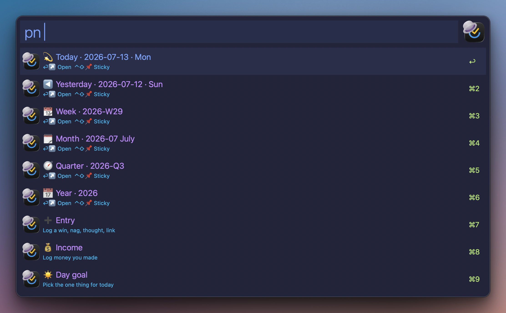
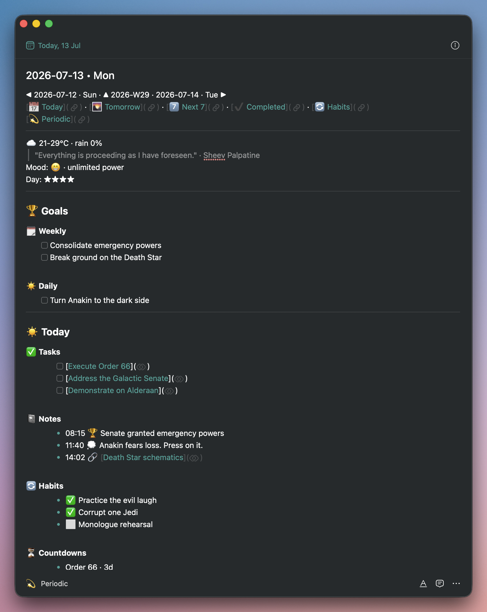

# 💫 Periodic notes

_TickAL docs: [Home](00-index.md) · [Setup](30-setup.md) · [Cheatsheet](95-cheatsheet.md)_

> Obsidian-style daily, weekly, monthly, quarterly and yearly notes - minted, refreshed and rolled up for you, inside TickTick.

**Keyword:** `tpn` · **Hotkey:** (set in canvas) - or the `pn` scope inside search (`tse pn …`, or `/pn` anywhere in the bar), or the **💫 Periodic Notes** row in the main menu (`tal`). Typing `daily note`, `weekly note` (or just `weekly`, `monthly`…) anywhere in search also surfaces the matching note. Or jump straight in with a direct keyword - see [Direct keywords](#direct-keywords).

## Why

If you keep periodic notes in Obsidian, you know the concept. Now put them where the tasks already live: everything time-bound in one place, one keyword away - fully automated daily, weekly, monthly, quarterly and yearly notes inside TickTick. The notes feed each other: yearly goals surface in the quarterly, quarterly in the monthly and weekly, weekly in the daily - a pyramid that keeps the big picture in view while you pick the daily work that actually moves the needle. Journals log moods and day ratings. Every note lists the period's scheduled tasks, a recap of the period before, and what is coming. The weekly compares itself to the last one, number by number, so you can watch yourself get 1% better. A daily income log rolls up week → month → quarter → year. Thoughts, wins, nags - logged in seconds, each action one keyword away.

Try it tomorrow: `tmj` fills the morning journal, `tdn` opens the daily note. Set the week's goal in the weekly note, pick the day's one thing in the daily - and today's work visibly pushes the week.

> [!IMPORTANT]
> Periodic notes are a workflow with many moving parts - minting, refresh, roll-ups, journals, reviews. Give this page a full read before diving in.

## The moving parts

| Part | What it is | Who makes it |
|---|---|---|
| **💫 Notes list** | One TickTick list of your choosing holds every periodic note (`periodic_list_id`) | You, once |
| **The notes** | Daily / weekly / monthly / quarterly / yearly - normal TickTick notes with generated sections, each sitting on its period's last day - the daily on its own day at 04:30, the weekly on Sunday and the month, quarter and year on their last day at 05:00 - so TickTick's Today and calendar show them at the top of the day. Alfred's Today, Tomorrow and Next 7 Days lists leave them out: their bulk verbs act on every row | The automation - minted when you open them, or by the agent |
| **💫 tag family** | 💫Daily … 💫Yearly, nested under 💫Periodic - group the list by Tag and they become kanban columns | The automation |
| **Refresh** | Rebuilds the generated sections, completes ticked boxes, recomputes roll-ups | The automation - on open, on 🔄, or by the agent |
| **♻️ Weekly review mirror** | A list (or a task with subtasks) the weekly note mirrors both ways (`weekly_review_id`) | You, optional |
| **The 04:30 agent** | Mints the new day before you wake and seals closed periods | You, optional install ([below](#the-0430-agent)) |

## Set it up once

1. **Create the notes list** in TickTick - any name works. Copy its id: `tse l <name>` → ⌘⏎ → **🆔 Copy id**, then paste it into **Configure Workflow → Periodic notes list id**. Empty = the whole feature stays off; every `pn` surface shows a setup pointer instead.
2. **Group the list by Tag** in TickTick - one manual click (the API can't set views) - and the kanban columns build themselves.
3. **Optional - weekly review mirror:** paste a second id into **Weekly review list id** - a list (or a task with subtasks) the weekly note mirrors in its ♻️ Weekly Review section.
4. **Optional - the [04:30 agent](#the-0430-agent):** the day's note exists before you wake. Without it, notes are minted the moment you open them.
5. **Optional - the [v2 token](30-setup.md#attachments--completed-v2-token):** fills the 🔄 Habits, ⏳ Countdowns and 🎯 Focus sections in the notes.

## Your first open

Type `tdn`. TickTick opens on a freshly minted daily note - head, nav and section skeletons already in place - and the generated sections fill in a few seconds later as the background refresh lands. That two-step draw is normal: open is instant, the refresh follows. The 💫 tags appear with that first mint too, so the group-by-Tag kanban columns show up from note one.

## The `pn` rows



| Row | Does |
|-----|------|
| 💫 Today / ◀ Yesterday / 📆 Week / 🗓 Month / 🧭 Quarter / 📅 Year | ⏎ open instantly (refresh catches up in the background) - **⌃⇧⏎ opens as a [sticky note](44-notes-links-images.md#sticky-notes)**, **⌃⌥⏎ as a [live window](44-notes-links-images.md#live-window)** |
| ➕ Entry | log a win, nag, thought, link, task, highlight or money - ⏎ shows the kind legend, or type straight: `+ w Shipped the thing` |
| ☀️ Day goal | pick (or create) today's one thing - pinned + scheduled today |
| ☀️ Add to today / 🌙 Add to tomorrow | pick any task or note → ⏎ schedules it (type `14:30` for a time) |
| 🌅 / 🌙 / 📔 Journal | morning, evening, weekly - one macOS dialog per question |
| 🎯 Weekly goal | pick a task (or type a plain goal) |
| 🗓️ Week highlight | one thing that stands out - lands in the weekly note's ✨ Highlight (and in the weekly journal's highlight answer when the section is gone) |
| 🔄 Refresh today | complete ticked boxes + rebuild the generated sections |

Entry kinds, each with a one-letter prefix: 🟢 `w` win · 🔴 `n` nag · 💭 `t` thought (also the default - plain text works) · ❗️ `r` reminder · 🔗 `l` link (empty = clipboard) · ☑️ `k` task (creates a real Inbox task, linked into ✅ Today, searchable immediately) · ⭐️ `h` the week's highlight · 💰 `$` money · 📋 `b` [backlog](#-backlog-fill-in-a-day-you-missed). ⏎ on the ➕ Entry row lists the legend; picking a kind autocompletes its prefix, then type the text and ⏎ logs it.

### 📋 Backlog, fill in a day you missed

Skipped shutdown? `+ b` lists what a day can hold: ✨ its highlight, 💰 money, 😊 mood, ⭐️ the day rating. Pick one, type the value, and the same day strip appears: this week Monday to today, today first, each day showing what it already holds.

Every one of these is a single answer in that day's journal, so they all ride one screen rather than four. A day you skipped entirely has no questions in it at all yet - they get planted the moment you fill one in, and planting them on an old day gives that day exactly the questions it would have had, nothing of today's.

A day that already has an answer never takes a stray ⏎. It stops on a screen showing what's there: **Keep it** first, **Replace it** as a second row you have to choose. Money is the exception, because two payments in one day are two payments: there the first row **adds**.

`*mon`, `*yesterday`, `*-2`, `*9` skip the picking. Day words look backwards here - you're filling in a day you have already lived.

The daily note's ✨ line and the weekly's ✨ Highlights, 😊 Moods and 💰 Income all read those same answers, so filling a day in reaches every one of them. You can also just type the answer into the note by hand on your phone: the weekly picks it up on its next refresh either way.

### 💰 Money, any day this week

Money has its own front door, one step further into the same machine. Type the amount, pick the day. `+ $ 485 tattoo` lists this week Monday to today, today first, with what each day already holds, and ⏎ on a day logs it there. So a day you skipped the evening journal on is the same move as today, not a special mode.

A day's money IS the evening journal's money answer for that day, and this row writes that same answer - there is no second record to disagree with it, and the weekly's 💰 Income sums those answers straight back up. A day that already holds a number therefore cannot be overwritten by a stray ⏎: it stops on a screen that shows you what is there, offers **Add it** first, and makes changing the number a second row you have to choose. Whatever you typed in the answer by hand survives being added to.

Skip the picking with a trailing `*mon`, `*yesterday`, `*-2` or `*9` - day words look backwards here, because you are filling in a day you have already lived.

One limit worth knowing: a week that has already closed keeps the numbers it was sealed with. The daily note takes your entry, but that older weekly note will not move - its totals cannot be safely recomputed once the completed-task feed has scrolled past them.

The same moves work from a task's **⌘ Actions** menu: ☀️ Add to today, 🌙 Add to tomorrow, ☀️ Make day goal. The add window's `/` menu has ☀️ Today and 🌙 Tomorrow shortcuts too.

## Direct keywords

Every pn row also has its own keyword, so you can jump straight in without opening the surface first:

| Keyword | Does |
|---------|------|
| `tpn` | open the periodic surface (all rows) |
| `tdn` / `twn` / `tmn` / `tqn` / `tyn` | open today / week / month / quarter / year note |
| `tmj` / `tej` | morning / evening journal |
| `tde` | log an entry to today |
| `tmo` | log income |
| `tdg` | set today's one thing |
| `tat` | schedule a task today |

Without `periodic_list_id`, every one of these shows a setup pointer instead. Opening or journaling auto-mints the note if it does not exist yet.

## The daily note



The head of the note (the breadcrumb, then the weather and the quote) is composed for you above the first section. Your mood and the day's stars live in the journals now, with the questions that ask for them. Then, grouped under `#` headers with dividers: **🌉 Yesterday's bridge** → **✨ Highlight** (the one thing the day is remembered for, asked at shutdown) → **🏆 Goals** (🗓️ Weekly mirror + ☀️ Daily one-thing) → **☀️ Today** (✅ Tasks - every task scheduled today as a checkbox link → 📓 Notes → 🔄 Habits → ⏳ Countdowns → 💰 Money) → **🔎 Summaries** (📊 Today → ⏪ Yesterday, the full list of what you completed → ⏩ Tomorrow) → 🌅 / 🌙 journals.

**Tick a box in ✅ Tasks or ⏩ Tomorrow - in the app, on your phone, anywhere - and the next refresh completes the real task.** Refresh happens when you open the note through `pn` (if the last one is more than a minute old), when the agent runs, or on the 🔄 row; TickTick can't run code when a note opens, so a note opened via breadcrumbs shows its last-refreshed state.

**It works the other way too: complete a task and its line ticks.** Every completion TickAL makes - ⇧ on a row, a routine's Finish link, the focus bar's ● and ○, the buffer, the CRM verbs - queues a catch-up of today's note, run once about 20 seconds after the last completion in a burst, so ticking a routine's ten steps costs one refresh. Today's note gets the full refresh (ticks, 🔄 Habits, the summaries); yesterday's note gets its ticks, so a Shutdown finished after midnight still ticks in the day it ends. A task completed in the TickTick app ticks at the next refresh.

## Journals

All five journals seed their questions into the note at mint, so you can answer from any device by typing after `A:`. Running them from Alfred asks each **unanswered** question in a dialog - ⏎ saves and advances, empty ⏎ skips, Cancel stops and keeps what you answered. Phone answers are never overwritten.

- **Morning** (3 fixed + 3 drawn from an editable pool, below): mood (1-5), what's on your mind, the one thing - then, if no day goal is set, the ☀️ picker opens by itself.
- **Evening** (6 fixed + 5 drawn): the 🌉 bridge, ✨ the highlight of the day, 🎯 tomorrow's goal, on your mind, *did you achieve your daily goal - {your goal}?*, money earned, rate the day (the stars stay in the journal answer).
- **Weekly** (2 fixed + 5 drawn): the week's highlight (the answer IS the record, and 🕰️ On this day reads it back years later), *did you achieve your weekly goals?* - then a picker asks for **three things that would make next week a success**, written into next week's 🎯 Goals.
- **Monthly** and **Quarterly** (2 fixed + 5 drawn each): that period's highlight and *did you achieve your goals?*, named - then the goal editor opens aimed at the **next** month or quarter, and stays open until you Esc.

Edit the pools: copy `src/periodic_prompts/{morning,evening,weekly,monthly,quarterly}.md` to `~/.ticktick_alfred/periodic_prompts/` and make them yours.

The goal questions (the evening's 🎯 tomorrow, the morning's ☀️ check) stop the dialogs and open the goal picker in Alfred; your pick answers the question and the journal carries on with the next one in a fresh run that starts right after the pick. Every run leaves a trail in `~/.ticktick_alfred/run/tickal_journal.log`: when it started, how each question went (answered, skipped, cancelled, and how long it took), the handoff and the pick. Events and timings only - never an answer.

## Goals

One 🏆 Goals screen per tier (`pn` → 🏆 Goals). The daily keeps **one** - the One Thing, which replaces itself. Every other tier **appends**, so a week, a month, a quarter or a year can carry several.

Each screen shows **what is already there**, one row per goal, `⏎` to remove it, with a ✅ Done row underneath. Typing gives you the three shapes: plain text, a task to pick, or `text | task` for both. After each one it re-opens, so you can keep adding and Esc when you are finished - the way adding subtasks works.

The weekly, monthly and quarterly journals end by opening that screen aimed at the **next** period: the weekly asks for three things, the month and the quarter for as many as you want.

**Next week, by hand:** the ♻️ Weekly screen and the 🎯 goal picker carry a **⏭ Next week** row. ⏎ turns every row on the screen towards next week - its goals, its plan, what you pick or type - and **🔙 This week** turns it back. Made for the Sunday review, when "this week" is the one ending.

The pickers rank the way search does: a whole-name match, then a match at the start of a word, then inside a word, and within each of those tasks before notes and top-level tasks before subtasks. A link's address never matches, only the words you see. Bridge notes never show up in a goal picker - a bridge records a session, it is not a goal.

Goals mirror downward, read-only: the quarter's appear in each month, the month's in each week, the week's in each day. Setting them anywhere but their own note is not a thing - the mirror resets to a pointer the moment the parent's goal is cleared.

A goal line you edit in the TickTick app comes back with its markdown escaped; every refresh heals the note's own goal lines, so a link never stays as literal brackets. A goal picked from a task is written with that task's real title, or refused with a toast when the title cannot be read - never as a link that only says "Task".

## Money - the roll-up pyramid

Log from the `pn` bar (`tpn`, or `tse pn`): type `$ 485 tattoo` → the daily gains `- 485 · tattoo` and the day **Total** recomputes (the `tmo` keyword jumps straight to the `$`). The weekly's 📌 This Week section shows one line per day - `- Sat 11 Jul 2026 • 485` - with the total; monthly shows week sums; quarterly shows months; yearly shows quarters. Roll-ups always recompute from the daily notes, so a week straddling two months never double-counts.

## The weekly note

Minted Sunday for the week ahead - and opening it midweek mints it on the spot, like every note. Top to bottom:

- **The week's days** - under the breadcrumb, one line per day of that week, linked to that day's note. A day whose note does not exist yet sits there as plain text and becomes a link on the next refresh while the week is still live. A week that has already closed keeps whatever its head said when it closed, unless you run the catch-up tool below.
- **🏆 Goals** - one bullet per tier, the daily note's shape one level up: **🌓 Quarterly** and **🗓️ Monthly** are read-only mirrors of those notes' own goals (set them there - the mirror resets to a pointer line the moment the parent's goal is cleared, so it can never show a stale one), and **♻️ Weekly** is the week's own. Only ♻️ Weekly travels: it is what the daily note mirrors and what the weekly journal means by *did you achieve your weekly goals?*. Delete a bullet and that mirror stops, like every section here.
- **✨ Highlight** - yours to write (the 🗓️ Week highlight row and the weekly journal both land in ✨).
- **📌 This Week → 📊 Stats** - the numbers, each on its own bullet, most of them carrying the figure in the bullet itself with a vs-last-week chip in the daily note's arrow language (`- Completed: 78 · 🔴 ▼ 309 (−80%)`): Top lists · Top tasks · Created · Completed · Daily Completed (per-day bars) · 🥅 Aligned (the share of the week's done work that served an objective, and each objective's done count and focus - see [OKRs](50-okrs.md#in-your-periodic-notes)) · Focus (by day, with the day's top task) · Habit consistency.
  - **Top lists** and **Top tasks** are the three busiest lists and the three most-completed tasks, and both skip your routines list - a thing you do seven days a week is not news. The headline counts still count everything, so they stay comparable with the weeks already written.
  - **Habit consistency** measures each habit against its OWN week: a once-a-week habit reads `0/1`, not `0/7`, and a habit with nothing due this week is not listed.
- **📌 This Week → 💿 Data** - ✨ Highlights (each day's, newest first) · 📨 Entries (every win/nag/thought/link, grouped, newest first) · 😊 Moods (the average, with last week, in the bullet; the day's note underneath it) · 💰 Income (day lines) · 👽 People.
- **⏪ Last week** - the five headline numbers, then the same two rankings.
- **📔 Weekly journal**.
- **♻️ Weekly Review** - a live mirror of your review list, sections preserved, both directions: tick in the note and the real task completes; the source re-mirrors on every refresh.

Rearranged it yourself? Sections are found BY NAME wherever you put them, so moving and renesting is free.

A note's shape is fixed when it is minted - refresh fills bodies, it never reshapes. So when the shipped layout changes, the week already open keeps the old one and is left strictly alone (never half-rewritten) until the next Monday mints a fresh note. To move it over now instead, `tools/pnrepair/relayout_{daily,weekly,monthly,quarterly}.py` rebuilds it in place: your goals, journal answers and review ticks ride across, anything the new layout has no home for is kept verbatim at the bottom, it prints the result and changes nothing without `--apply`, and it refuses outright if a single line you wrote would be lost. Weeks already closed keep the shape they were written in - their numbers exist nowhere else. The one thing they do get is `tools/pnrepair/weekday_links.py`, which stamps the day links into any weekly note's head (dry run by default, `--apply` to write): it touches the breadcrumb and those seven lines and nothing else, so a closed week's numbers are safe.

## The monthly note

The weekly note's shape one tier up, counted by **week** instead of by day (Vex rebuilt it by hand on 2026-09-17, same as the other two).

- **The month's weeks** - under the breadcrumb, one line per week, linked to that week's note. Labels are month-local and clipped to the month: `W1 · 1st-6th Sep`, `W5 · 28th-30th Sep`. Every week number in the note carries its date range, everywhere.
- **🏆 Goals** - **🌓 Quarterly goal** mirrors the quarter's note; **🗓️ Monthly goal** is yours, and it is what the weekly notes mirror in turn.
- **✨ Highlight**, then **📊 Stats** and **💿 Data** with the weekly's own bullets: Top lists · Top tasks · Created · Completed · Weekly Completed (per-week bars) · Focus (by week, with the week's top task) · Habit consistency, then ✨ Highlights · 📨 Entries · 😊 Moods · 💰 Income · 👽 People · 🥘 Meal prep (the week's meals from Mela's calendar, written by 🔄 Sync with Mela in the [🥘 hub](51-meal-prep.md)).
- **😊 Moods** reads the month average with its vs-last-month arrow in the bullet, and one line per week underneath.
- **⏳ Dates** - every birthday and countdown landing in that month, by date. Days already past count: a birthday on the 3rd is still what the month held.
- **⏪ Last month** - the five headline numbers and the same two rankings, read off last month's weeks. It stays `_(pending)_` rather than showing zeros when none of those weeks can be read.
- **📔 Monthly journal** - seeded at mint like the other three, answerable from your phone by typing after `A:`.
- **♻️ Monthly Review** - the weekly's mirror with its own source, ticking both ways. It reads `monthly_review_id` from `~/.ticktick_alfred/config.json`; there is no Configure-panel field for it yet, unlike the weekly's.
- **📨 Entries** resurfaces **five of each kind** - wins, nags, reminders, thoughts, links - each carrying its date, because over a month "Thu" names four different days. Nothing an entry carries says how big it was, so "top five" is a rule: **one per week, newest first, then fill what is left by recency**. Five wins therefore come from across the month rather than all from its last few days. A month long enough to touch six weeks has more weeks than slots, and the oldest one loses its place.

**Where the numbers come from, and the one thing that limits them.** Focus, money, moods, highlights, entries, habits and people are recomputed from sources that keep, so they are exact for any month. **What you finished and what you added are not**: TickTick's completed feed reaches back about nine days, and the task cache only holds what is still open, so both come off the **weekly notes** - the same pyramid money has always used.

That has three consequences worth knowing:

- A week whose note does not exist reads `no note` in the bars rather than `0`, and the month total counts only the weeks it could read. A week that has not started yet is simply not listed.
- The **rankings** (Top lists, Top tasks, and the 🗂 breakdowns) come from the weeks lying **wholly inside** the month, plus the one still running. A sealed week straddling two months keeps its ranking in week shape and nothing can cut that by day, so it is left out rather than let the neighbouring month's traffic in. Like the weekly, the rankings skip your routines list; the headline counts do not.
- Weeks written before 2026-09-17 still give up their numbers; their rankings only partly survive, because the old layout kept those in the header.

## The quarterly note

The monthly's shape counted by **month**, and the old skeleton is gone - 🎯 OKR review, 🚀 Next-Q OKRs, ⚖️ Decision log, 🔋 Energy audit and 💡 Observations never had a filler and were never filled by hand (Vex 2026-09-17: "kill it all, adhere to our existing logic").

- **The quarter's months** under the breadcrumb, linked: `M1 · July · M2 · August · M3 · September`.
- **🏆 Goals** - 🎉 Yearly goal mirrors the year's note, 🌓 Quarterly goal is yours.
- Then ✨ Highlight, 📊 Stats (with **Monthly Completed** bars and focus by month), 💿 Data (moods by month, income by month, the quarter's 🎂 dates), **⏪ Last quarter**, **📔 Quarterly journal** and **♻️ Quarterly Review**.

A month never straddles a quarter, so none of the clipping the monthly needs applies: the quarter just sums its months' headlines. A month whose note cannot be read says `no note`, and one whose note exists but carries no numbers says `no numbers` - never 0. A roll-up summed out of only some of its children says so in its own header (`Completed: 466 · 1 of 3 months`) and draws no vs-last-period arrow, because half a quarter and a whole one are not comparable. `tools/pnrepair/relayout_quarterly.py` rebuilds a note minted under the old skeleton.

**Yearly** still ships as a template + money roll-up - it gains its quarter links in the head, and the rest lands in a later release.

The **📔 journal** runs at five slots now: morning, evening, weekly, monthly and quarterly. Each has its own pool and its own draw.

## The 04:30 agent

One row installs it. Use any `pn` action once first (that mirrors your ids into the config the agent reads), then `tup` (Settings) → **Periodic Agent** - a dialog shows the current state and offers **Install**, **Remove**, or **Repair** after a workflow update. No files to edit, no terminal.

Every morning at 04:30 (or on wake/login if the Mac slept through it) it mints **the day that just started** - plus the coming week's weekly on Sundays - refreshes today, seals the periods that just closed (one last refresh, then the note rests as a record) and recomputes the roll-ups. Log: `/tmp/tickal_periodic.log`. Missed everything? Opening any note via `pn` creates and refreshes it on the spot.

## macOS Shortcuts

Every action is externally fireable - one AppleScript step:

```
osascript -e 'tell application id "com.runningwithcrayons.Alfred" to run trigger "XAct" in workflow "com.vex.tickal" with argument "xact:pn_entry:w Shipped the thing"'
```

Same shape for `xact:pn_income:485 tattoo deposit`, `xact:pn_journal:evening`, `xact:pn_open:daily`, `xact:pn_mood:4`, `xact:pn_highlight:Best week`, `xact:pn_refresh`.

## Limitations

- The `###` section headers are the machine's anchors - rename one inside a note and its filler goes quietly blind (the rest of the note is untouched). Deleting a section from your note-template override turns that feature off: that's the intended kill switch. (Power users: copy `src/periodic_templates/` into `~/.ticktick_alfred/periodic_templates/` and edit - the same override mechanism as the journal pools.)
- Opening via `pn` is instant; the refresh lands a few seconds later and the open note redraws. Watch it happen, or use 🔄 to refresh in the foreground.
- Ticked boxes complete their real tasks for about a day after the note's period ends; older ticks in stale notes are left alone on purpose (a note is a record - re-completing a long-reopened task would be worse). The same day of grace runs the other way: a completion ticks today's and yesterday's lines, never an older note's.
- Don't complete a periodic note itself; if you did, uncomplete it - a completed note drops out of the index and a blank twin gets minted.
- Group-by-Tag on the list is a view setting the API can't set - one manual click in TickTick.
- Weather (Open-Meteo, located once by IP) and the quote of the day are best-effort: no network, no lines, no error.
- Generated sections (Nav, 📌 This Week, 📨 Entries, recaps, money roll-ups, the ♻️ mirror) are rewritten on refresh - your own text belongs in 📓 Notes, 🎯 Goals and the journal answers, which are never rewritten.
- The weekly's rankings skip your routines list by id. Another list you want out of them: `stats_ignore_lists` in the environment, comma-separated ids.

## Related

- [Search](40-search.md) - the `pn` scope lives in search
- [Focus](46-focus.md) - the same checkbox-link + sweep machinery
- [Setup](30-setup.md) - the v2 sign-in that powers habits/countdowns/focus stats
- [Settings & sync](90-settings-sync.md) - the config fields
